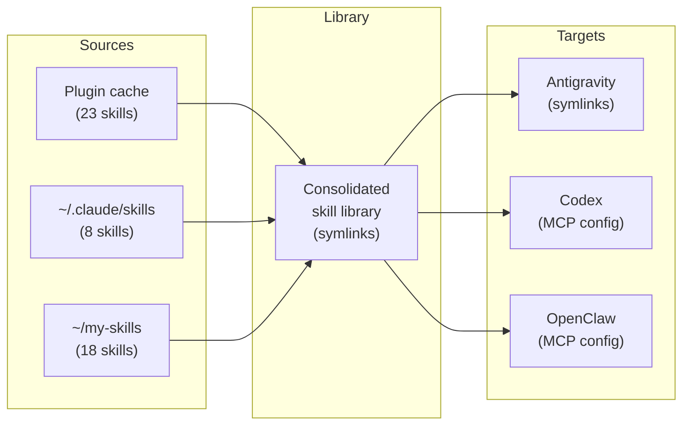

<p align="right">
  <a href="https://github.com/MartinP7r/tome/actions/workflows/ci.yml"></a>
  <a href="https://github.com/MartinP7r/tome/releases"></a>
  
  
</p>

# tome 📖

*Your skills, leather-bound.*

<p align="center">
  
</p>

Sync AI coding skills across tools. Discover skills from Claude Code plugins, standalone directories, and custom locations — then distribute them to every AI coding tool that supports the SKILL.md format.

> **Beta software.** tome is under active development and may contain bugs that could break your local skills setup or interfere with other tooling. Back up your skills directories (e.g., with git) before running `tome sync` for the first time. Use `--dry-run` to preview changes without modifying anything.

## Why

AI coding tools (Claude Code, Codex, Antigravity) each use SKILL.md packages to provide context. But skills get siloed:

- Plugin skills live in cache directories you never see
- Standalone skills only exist for one tool
- Switching tools means losing access to your skill library

**tome** consolidates all skills into a single library and distributes them everywhere.

## Install

**Homebrew** (macOS/Linux):
```bash
brew install MartinP7r/tap/tome
```

## Quick Start

```bash
# Interactive setup — discovers sources, configures targets
tome init

# Sync skills to all configured targets
tome sync

# Check what's configured
tome status
```

## Commands

| Command       | Description                                         |
| ------------- | --------------------------------------------------- |
| `tome init`   | Interactive wizard to configure sources and targets |
| `tome sync`   | Discover, consolidate, and distribute skills        |
| `tome status` | Show library, sources, targets, and health          |
| `tome list`   | List all discovered skills with sources             |
| `tome doctor` | Diagnose and repair broken symlinks                 |
| `tome serve`  | Start the MCP server (stdio)                        |
| `tome config` | Show current configuration                          |

All commands support `--dry-run`, `--verbose`, and `--config <path>`.

## How It Works



1. **Discover** — Scan configured sources for `*/SKILL.md` directories
2. **Consolidate** — Symlink discovered skills into a central library (deduplicates, first source wins)
3. **Distribute** — Create symlinks or MCP config entries in each target tool's directory
4. **Cleanup** — Remove stale symlinks for skills that no longer exist

## Configuration

TOML at `~/.config/tome/config.toml`:

```toml
library_dir = "~/.local/share/tome/skills"
exclude = ["deprecated-skill"]

[[sources]]
name = "claude-plugins"
path = "~/.claude/plugins/cache"
type = "claude-plugins"

[[sources]]
name = "standalone"
path = "~/.claude/skills"
type = "directory"

[targets.antigravity]
enabled = true
method = "symlink"
skills_dir = "~/.gemini/antigravity/skills"

[targets.codex]
enabled = true
method = "mcp"
mcp_config = "~/.codex/.mcp.json"
```

## MCP Server

tome includes a built-in MCP server for tools that support the Model Context Protocol:

```bash
# Standalone binary
tome-mcp

# Or via the CLI
tome serve
```

The server exposes two tools:
- `list_skills` — List all discovered skills
- `read_skill` — Read a skill's SKILL.md content by name

## License

MIT
