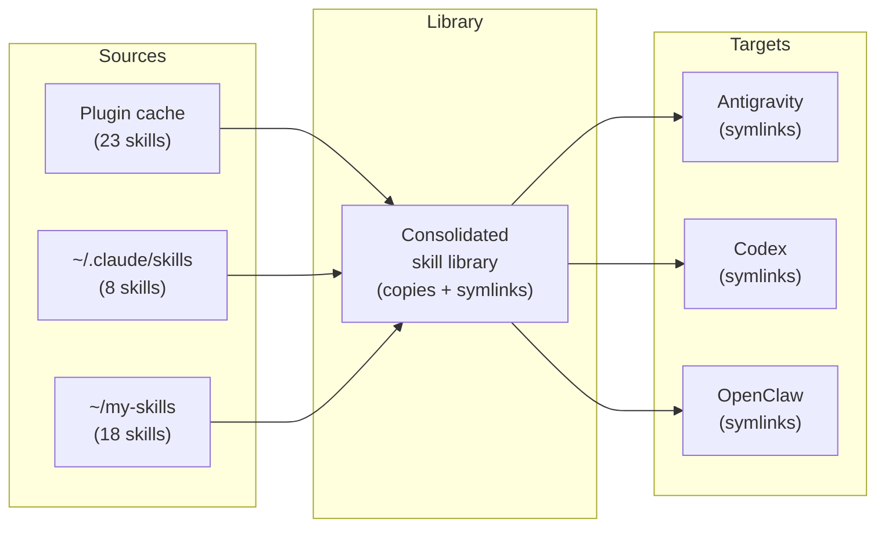

<p align="right">
  <a href="https://github.com/MartinP7r/tome/actions/workflows/ci.yml"></a>
  <a href="https://github.com/MartinP7r/tome/releases"></a>
  
  
</p>

# tome 📖

*Your skills, leather-bound.*

<p align="center">
  
</p>

Sync AI coding skills across tools. Discover skills from Claude Code plugins, standalone directories, and custom locations — then distribute them to every AI coding tool that supports the SKILL.md format.

> [!WARNING]
> **Beta software.** tome is under active development and may contain bugs that could break your local skills setup or interfere with other tooling. Back up your skills directories (e.g., with git) before running `tome sync` for the first time. Use `--dry-run` to preview changes without modifying anything.

## Why

AI coding tools (Claude Code, Codex, Antigravity) each use SKILL.md packages to provide context. But skills get siloed:

- Plugin skills live in cache directories you never see
- Standalone skills only exist for one tool
- Switching tools means losing access to your skill library

**tome** consolidates all skills into a single library and distributes them everywhere.

## Install

**Homebrew** (macOS/Linux):
```bash
brew install MartinP7r/tap/tome
```

## Quick Start

```bash
# Interactive setup — discovers sources, configures targets
tome init

# Sync skills to all configured targets
tome sync

# Check what's configured
tome status
```

## Development

For repository workflow guidance, see [docs/src/development-workflow.md](docs/src/development-workflow.md). It explains when `tome` uses GitHub Issues vs OpenSpec vs GSD, and how to link them cleanly in commits and PRs.

## Commands

| Command            | Description                                              |
| ------------------ | -------------------------------------------------------- |
| `tome init`             | Interactive wizard to configure directories               |
| `tome sync`             | Reconcile, discover, consolidate, distribute, clean up    |
| `tome add <url\|path>`   | Register a directory (git URL or local path)              |
| `tome remove dir <name>` | Remove a directory (manifest entries become Unowned)      |
| `tome remove skill <name>` | Delete an Unowned skill from the library                |
| `tome reassign <skill> --to <dir>` | Re-anchor an Unowned skill to a directory       |
| `tome fork <skill>`     | Promote a managed skill to local (editable in library)    |
| `tome status`           | Show library, directories, last-sync, and health          |
| `tome list`             | List all discovered skills with directory                 |
| `tome browse`           | Interactively browse discovered skills (fuzzy search)     |
| `tome doctor`           | Diagnose issues (Library / Directory / Config / Foreign-symlink) |
| `tome lint`             | Validate skill frontmatter and report issues              |
| `tome config`           | Show current configuration                                |
| `tome backup`           | Git-backed backup and restore for the skill library       |
| `tome eject`            | Remove tome's symlinks from all targets (reversible)      |
| `tome relocate`         | Move the skill library to a new location                  |
| `tome migrate-library`  | Convert a v0.9-shape library to v0.10 real-directory copies |
| `tome completions`      | Install shell completions (bash, zsh, fish, powershell)   |

All commands support `--dry-run`, `--verbose`, `--quiet`, `--no-input`, `--config <path>`, and `--machine <path>`. Logging routes through `tracing`; set `TOME_LOG` (e.g. `TOME_LOG=tome::sync=debug`) for fine-grained control beyond the flags.

## How It Works


```mermaid
graph LR
    subgraph Sources
        S1["Plugin cache<br/>(23 skills)"]
        S2["~/.claude/skills<br/>(8 skills)"]
        S3["~/my-skills<br/>(18 skills)"]
    end

    subgraph Library
        L["Consolidated<br/>skill library<br/>(copies + symlinks)"]
    end

    subgraph Targets
        T1["Antigravity<br/>(symlinks)"]
        T2["Codex<br/>(symlinks)"]
        T3["OpenClaw<br/>(symlinks)"]
    end

    S1 --> L
    S2 --> L
    S3 --> L
    L --> T1
    L --> T2
    L --> T3
```

1. **Reconcile** — Lockfile-authoritative drift detection for managed skills (Match / Drift / Vanished); applies updates via marketplace adapter when consent is granted
2. **Discover** — Scan configured directories (role `managed`/`source`/`synced`) for `*/SKILL.md`
3. **Consolidate** — Copy every skill — managed *and* local — into the library as a real directory (v0.10+ library-canonical model; managed are no longer symlinks). Deduplicates with first directory winning
4. **Distribute** — Create symlinks in each `target`/`synced` directory (respects per-machine `disabled` + `disabled_directories` + per-directory filters)
5. **Cleanup** — Three-bucket stale-skill report (removed-from-config / missing-from-disk / now-in-exclude-list); orphan transitions to Unowned preserve library content

## Configuration

TOML at `~/.tome/tome.toml`:

```toml
library_dir = "~/.tome/skills"
exclude = ["deprecated-skill"]

[directories.claude-plugins]
path = "~/.claude/plugins/cache"
type = "claude-plugins"   # role defaults to "managed"

[directories.local-skills]
path = "~/.claude/skills"
type = "directory"
role = "synced"           # discover AND distribute here

[directories.team-skills]
path = "https://github.com/myorg/team-skills"
type = "git"
ref = "main"

[directories.antigravity]
path = "~/.gemini/antigravity/skills"
type = "directory"
role = "target"           # distribution only
```

Each directory declares a `role`: `managed` (read-only upstream), `source` (discover only), `target` (distribute only), or `synced` (both). The model is fully data-driven — add any new tool by adding a `[directories.<name>]` entry. See [docs/src/configuration.md](docs/src/configuration.md) for the full schema (including v0.6 migration from `[[sources]]`/`[targets.*]`).

## Per-Machine Preferences

Control which skills are active on each machine via `~/.config/tome/machine.toml`:

```toml
# Skip these skills entirely on this machine
disabled = ["noisy-skill", "work-only-skill"]

# Don't distribute to these directories on this machine
disabled_directories = ["openclaw"]

# Per-directory filtering (mutually exclusive — disabled OR enabled per directory)
[directory.antigravity]
disabled = ["claude-only-skill"]

[directory.work-laptop]
enabled = ["work-skill-a", "work-skill-b"]   # allowlist

# Per-machine path overrides (v0.9 — useful when the same tome.toml is shared across machines)
[directory_overrides.local-skills]
path = "/Users/me/dev/skills"   # replaces tome.toml's path on this machine
```

Disabled skills stay in the library but are skipped during distribution. `tome sync` reconciles managed-skill drift against the lockfile and offers interactive triage when new or changed skills are detected.

## License

MIT
