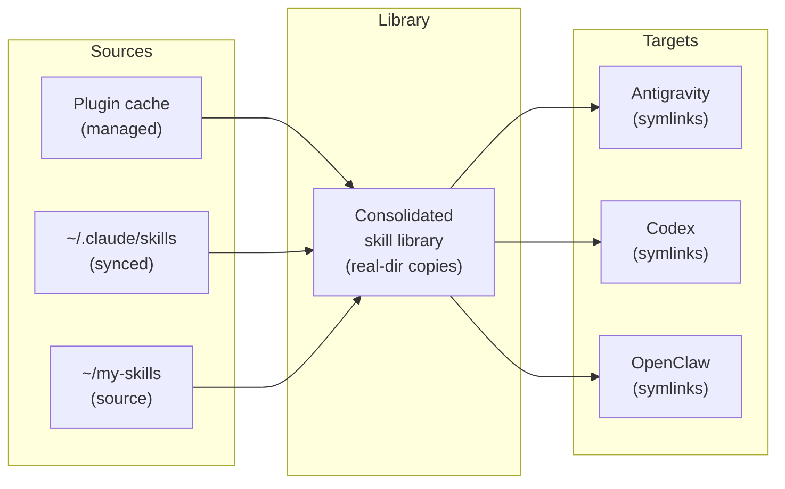

<p align="right">
  <a href="https://github.com/MartinP7r/tome/actions/workflows/ci.yml"></a>
  <a href="https://github.com/MartinP7r/tome/releases"></a>
  
  
</p>

# tome 📖

*Your skills, leather-bound.*

<p align="center">
  
</p>

Sync AI coding skills across tools. Import skills from native tool plugins,
standalone directories, and shared Git repositories, then route portable skills
to selected destinations by shared tags.

> [!WARNING]
> **Beta software.** tome is under active development and may contain bugs that could break your local skills setup or interfere with other tooling. Back up your skills directories (e.g., with git) before running `tome sync` for the first time. Use `--dry-run` to preview changes without modifying anything.

## Why

AI coding tools (Claude Code, Codex, Antigravity) each use SKILL.md packages to provide context. But skills get siloed:

- Plugin skills live in cache directories you never see
- Standalone skills only exist for one tool
- Switching tools means losing access to your skill library

**tome** consolidates all skills into a single library and controls which
portable skills each destination receives. Native tool plugins remain
tool-specific installation adapters; Tome owns the desired library state and
cross-tool routing.

## Install

**Homebrew** (macOS/Linux):
```bash
brew install MartinP7r/tap/tome
```

**Shell completions** (optional, recommended):
```bash
tome completions fish    # or: bash | zsh | elvish | powershell
exec fish                 # reload your shell
```

Re-run after upgrading tome — completion definitions are regenerated, not auto-refreshed.

## Quick Start

```bash
# Interactive setup — discovers sources, configures targets
tome init

# Sync the library and apply configured destination routes
tome sync

# Check what's configured
tome status
```

## Agent Skill

Tome ships a `using-tome` skill that teaches coding agents how to configure,
sync, diagnose, and recover a Tome library safely. `tome init` offers it during
interactive setup, or add it directly:

```bash
tome add MartinP7r/tome --subdir skills
tome sync
```

Claude Code users can alternatively install the same skill as a plugin:

```bash
claude plugin marketplace add MartinP7r/tome
claude plugin install tome@tome
```

`tome add` also accepts explicit local paths: absolute paths, `~` paths, and
dot-relative paths such as `./skills`. Dot-relative inputs are anchored to the
command's working directory. Anchored paths outside your home directory are
stored as absolute paths; paths under home may use portable `~/...` form. Both
resolve to the same add-time location, independent of later working directories.
Local directories default to the write-back `synced` role, so use
`--role managed` for package-manager-owned skills or `--role source` for other
read-only directories.

## Development

For repository workflow guidance, see [docs/src/development-workflow.md](docs/src/development-workflow.md). It explains when `tome` uses GitHub Issues vs OpenSpec vs GSD, and how to link them cleanly in commits and PRs.

## Commands

| Command            | Description                                              |
| ------------------ | -------------------------------------------------------- |
| `tome init`             | Interactive wizard to configure directories               |
| `tome sync`             | Reconcile, discover, consolidate, distribute, clean up    |
| `tome add <url\|path>`   | Register a shared Git source or profile-local directory; Git sources have no `--to` or `--role` |
| `tome tag add\|remove\|list` | Manage shared tags on library skills                  |
| `tome route tag ...`     | Select tags for a profile or project destination        |
| `tome route exclude ...` | Manage explicit per-destination skill exclusions         |
| `tome profile create\|list\|select` | Manage committed machine profiles             |
| `tome pool exclude\|restore` | Exclude a skill from the shared pool or restore it   |
| `tome remove dir <name>` | Remove a directory (manifest entries become Unowned)      |
| `tome remove skill <name>` | Delete an Unowned skill from the library                |
| `tome reassign <skill> --to <dir>` | Re-anchor an Unowned skill to a directory       |
| `tome fork <skill>`     | Promote a managed skill to local (editable in library)    |
| `tome status`           | Show library, directories, last-sync, and health          |
| `tome list`             | List all discovered skills with directory                 |
| `tome browse`           | Interactively browse discovered skills (fuzzy search)     |
| `tome doctor`           | Diagnose Library / Directory / Config / Foreign-symlink issues; auto-repair broken symlinks, stale manifest entries, and target real-dir collisions |
| `tome lint`             | Validate skill frontmatter and report issues              |
| `tome config`           | Show current configuration                                |
| `tome backup`           | Git-backed backup and restore for the skill library       |
| `tome eject`            | Remove tome's symlinks from all targets (reversible)      |
| `tome relocate`         | Move the skill library to a new location                  |
| `tome completions`      | Install shell completions (bash, zsh, fish, powershell)   |

Use `tome --version` for version output. Global options include `--dry-run`,
`--verbose`, `--quiet`, `--no-input`, `--config <path>`, `--settings <path>`,
and `--tome-home <path>`. There is no `--machine` option. Logging routes
through `tracing`; set `TOME_LOG` (for example,
`TOME_LOG=tome::sync=debug`) for fine-grained control beyond the flags.

## How It Works


```mermaid
graph LR
    subgraph Sources
        S1["Plugin cache<br/>(managed)"]
        S2["~/.claude/skills<br/>(synced)"]
        S3["~/my-skills<br/>(source)"]
    end

    subgraph Library
        L["Consolidated<br/>skill library<br/>(real-dir copies)"]
    end

    subgraph Targets
        T1["Antigravity<br/>(symlinks)"]
        T2["Codex<br/>(symlinks)"]
        T3["OpenClaw<br/>(symlinks)"]
    end

    S1 --> L
    S2 --> L
    S3 --> L
    L --> T1
    L --> T2
    L --> T3
```

1. **Reconcile** — Lockfile-authoritative drift detection for managed skills (Match / Drift / Vanished); applies updates via marketplace adapter when consent is granted
2. **Discover** — Scan configured directories (role `managed`/`source`/`synced`) for `*/SKILL.md`
3. **Consolidate** — Copy every skill — managed *and* local — into the library as a real directory (v0.10+ library-canonical model; managed are no longer symlinks). Deduplicates with first directory winning
4. **Distribute** — Create symlinks for skills selected by each destination's tag route; any matching tag is sufficient and an explicit skill exclusion wins
5. **Cleanup** — Three-bucket stale-skill report (removed-from-config / missing-from-disk / now-in-exclude-list); orphan transitions to Unowned preserve library content

## Configuration

Tome resolves shared policy, a selected profile, an optional project layer, and
local settings. Shared Git sources belong in `~/.tome/tome.toml`:

```toml
library_dir = "~/.tome/skills"
exclude = ["deprecated-skill"]

[directories.team-skills]
path = "https://github.com/myorg/team-skills"
type = "git"
branch = "main"
role = "source"
```

The selected `machines/<profile>.toml` contains machine-wide directories and
their routes:

```toml
[directories.local-skills]
path = "~/.claude/skills"
type = "directory"
role = "source"

[directories.antigravity]
path = "~/.gemini/antigravity/skills"
type = "directory"
role = "target"

[routes.antigravity]
tags = ["portable", "gemini"]
exclude = ["claude-only-skill"]
```

Tags are stored with each skill in `.tome-manifest.json`. A routed destination
receives a skill when any selected tag matches; `exclude` overrides a match.
Newly imported skills are untagged and remain library-only for tag-routed
destinations until classified:

```bash
tome tag add using-tome portable
tome route tag add --to antigravity portable
tome route exclude add --to antigravity claude-only-skill
```

From a project tree, Tome searches upward for `.tome.toml` and adds its
project-only target directories and routes. Local profile selection and runtime
consent live in `~/.config/tome/settings.toml`. See
[docs/src/configuration.md](docs/src/configuration.md) for the complete schema.

## License

MIT
