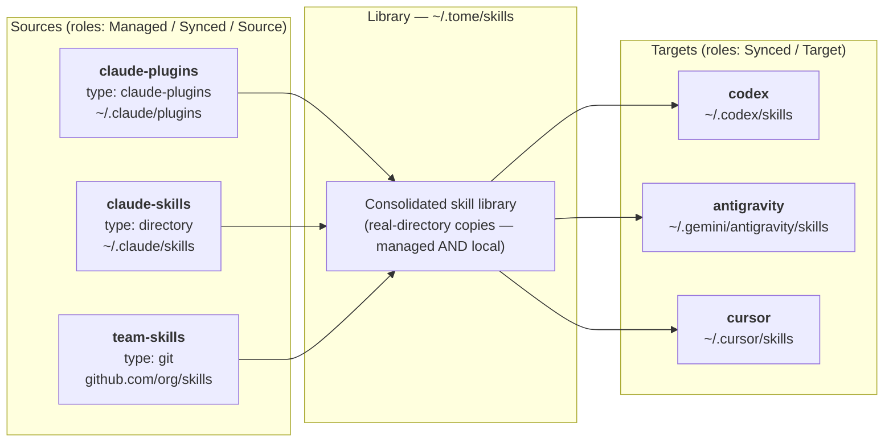

# Introduction

Sync AI coding skills across tools. Discover skills from Claude Code plugins, standalone directories, and custom locations — then distribute them to every AI coding tool that supports the SKILL.md format.

## Why

AI coding tools (Claude Code, Codex, Antigravity) each use SKILL.md packages to provide context. But skills get siloed:

- Plugin skills live in cache directories you never see
- Standalone skills only exist for one tool
- Switching tools means losing access to your skill library

**tome** consolidates all skills into a single library and distributes them everywhere.

## Install

**Homebrew** (macOS/Linux):
```bash
brew install MartinP7r/tap/tome
```

## Quick Start

```bash
# Interactive setup — discovers sources, configures targets
tome init

# Sync skills to all configured targets (with interactive triage)
tome sync

# Check what's configured
tome status
```

## How It Works

Every directory you configure — package-manager caches, per-tool skill dirs, git-hosted skill repos — lives under a single `[directories.*]` map in `tome.toml` with a *role* that tells tome how it participates in the pipeline.



1. **Reconcile** (v0.10+) — Diff managed-plugin state against the lockfile; with consent (`auto_install_plugins = "always" | "ask" | "never"` in `machine.toml`) apply install/update operations via the marketplace adapter before discovery
2. **Discover** — Scan every configured directory (types: `claude-plugins`, `directory`, `git`) for `*/SKILL.md` subdirs
3. **Consolidate** — Copy every skill — managed AND local — into `~/.tome/skills` as a real directory (library-canonical model, v0.10+). First-seen-wins on name conflicts. The `managed` flag denotes *update channel*, not storage form
4. **Distribute** — Create symlinks in each distribution directory (respects per-machine disabled/enabled filters)
5. **Cleanup** — Remove stale entries and broken symlinks from both library and distribution dirs; orphaned managed skills transition to **Unowned** (v0.14+) with library content preserved

> **v0.6+ unified directory model:** A directory can be *both* a source and a target (role: `Synced`). Discovery and distribution are determined by role, not by separate config sections. See [architecture](./architecture.md) for details.

## License

MIT
