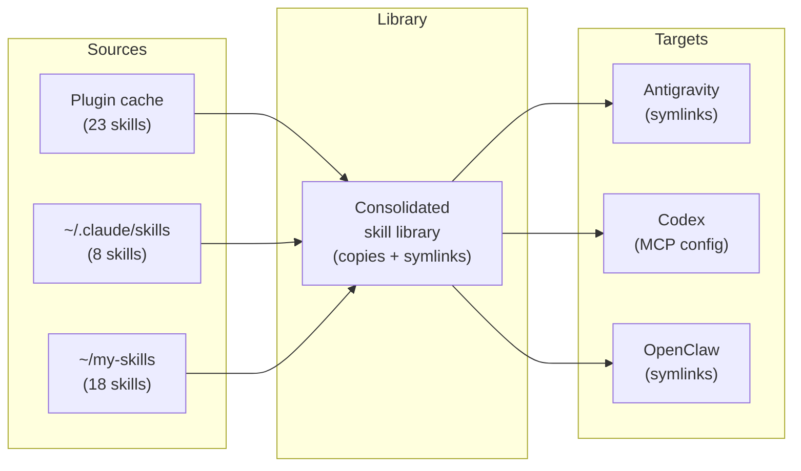

# Introduction

Sync AI coding skills across tools. Discover skills from Claude Code plugins, standalone directories, and custom locations — then distribute them to every AI coding tool that supports the SKILL.md format.

## Why

AI coding tools (Claude Code, Codex, Antigravity) each use SKILL.md packages to provide context. But skills get siloed:

- Plugin skills live in cache directories you never see
- Standalone skills only exist for one tool
- Switching tools means losing access to your skill library

**tome** consolidates all skills into a single library and distributes them everywhere.

## Install

**Homebrew** (macOS/Linux):
```bash
brew install MartinP7r/tap/tome
```

## Quick Start

```bash
# Interactive setup — discovers sources, configures targets
tome init

# Sync skills to all configured targets
tome sync

# Review new/changed skills interactively
tome update

# Check what's configured
tome status
```

## How It Works



1. **Discover** — Scan configured sources for `*/SKILL.md` directories
2. **Consolidate** — Gather skills into a central library: local skills are copied, managed (plugin) skills are symlinked; deduplicates with first source winning
3. **Distribute** — Create symlinks or MCP config entries in each target tool's directory (respects per-machine disabled list)
4. **Cleanup** — Remove stale entries and broken symlinks from library and targets

## License

MIT
