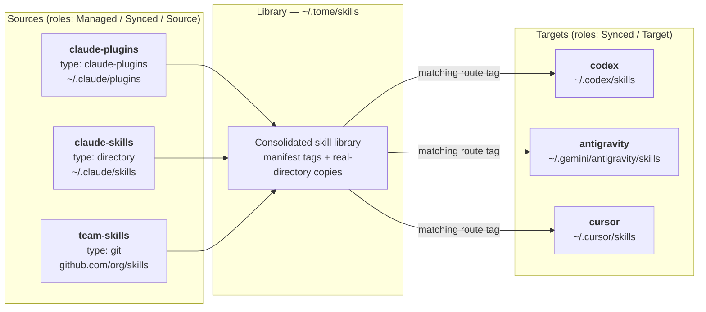

# Introduction

Sync AI coding skills across tools. Import skills from native tool plugins,
standalone directories, and shared Git repositories, then route portable skills
to selected destinations by shared tags.

## Why

AI coding tools (Claude Code, Codex, Antigravity) each use SKILL.md packages to provide context. But skills get siloed:

- Plugin skills live in cache directories you never see
- Standalone skills only exist for one tool
- Switching tools means losing access to your skill library

**tome** consolidates all skills into a single library and owns the desired
skill state and cross-tool routing. Native plugins remain tool-specific
installation adapters rather than becoming a universal plugin format.

## Install

**Homebrew** (macOS/Linux):
```bash
brew install MartinP7r/tap/tome
```

## Quick Start

```bash
# Interactive setup — discovers sources, configures targets
tome init

# Sync the library and apply configured destination routes
tome sync

# Check what's configured
tome status
```

## How It Works

Tome combines shared repository policy, a selected machine profile, the nearest
project `.tome.toml`, and local runtime settings. Shared Git sources live in
repository policy; machine-wide directories and routes live in
`machines/<profile>.toml`; project-only destinations and routes are discovered
by searching upward from the current directory.


```mermaid
graph LR
    subgraph Sources["Sources (roles: Managed / Synced / Source)"]
        S1["<b>claude-plugins</b><br/>type: claude-plugins<br/>~/.claude/plugins"]
        S2["<b>claude-skills</b><br/>type: directory<br/>~/.claude/skills"]
        S3["<b>team-skills</b><br/>type: git<br/>github.com/org/skills"]
    end

    subgraph Library["Library — ~/.tome/skills"]
        L["Consolidated skill library<br/>manifest tags + real-directory copies"]
    end

    subgraph Targets["Targets (roles: Synced / Target)"]
        T1["<b>codex</b><br/>~/.codex/skills"]
        T2["<b>antigravity</b><br/>~/.gemini/antigravity/skills"]
        T3["<b>cursor</b><br/>~/.cursor/skills"]
    end

    S1 --> L
    S2 --> L
    S3 --> L
    L -->|"matching route tag"| T1
    L -->|"matching route tag"| T2
    L -->|"matching route tag"| T3
```

1. **Reconcile** — Diff managed-plugin state against the lockfile; with `managed_plugin_install` consent from local `settings.toml`, apply install/update operations through the native tool adapter before discovery
2. **Discover** — Scan every configured directory (types: `claude-plugins`, `directory`, `git`) for `*/SKILL.md` subdirs
3. **Consolidate** — Copy every skill — managed AND local — into `~/.tome/skills` as a real directory (library-canonical model, v0.10+). First-seen-wins on name conflicts. The `managed` flag denotes *update channel*, not storage form
4. **Distribute** — Create symlinks when any skill tag matches the destination route; explicit destination exclusions override matches, and untagged skills stay library-only for routed destinations
5. **Cleanup** — Remove stale entries and broken symlinks from both library and distribution dirs; orphaned managed skills transition to **Unowned** (v0.14+) with library content preserved

Tags are stored with library entries in `.tome-manifest.json`; sources retain
provenance but do not choose destinations. See [Configuration](configuration.md)
and [Architecture](architecture.md) for the complete model.

## License

MIT
