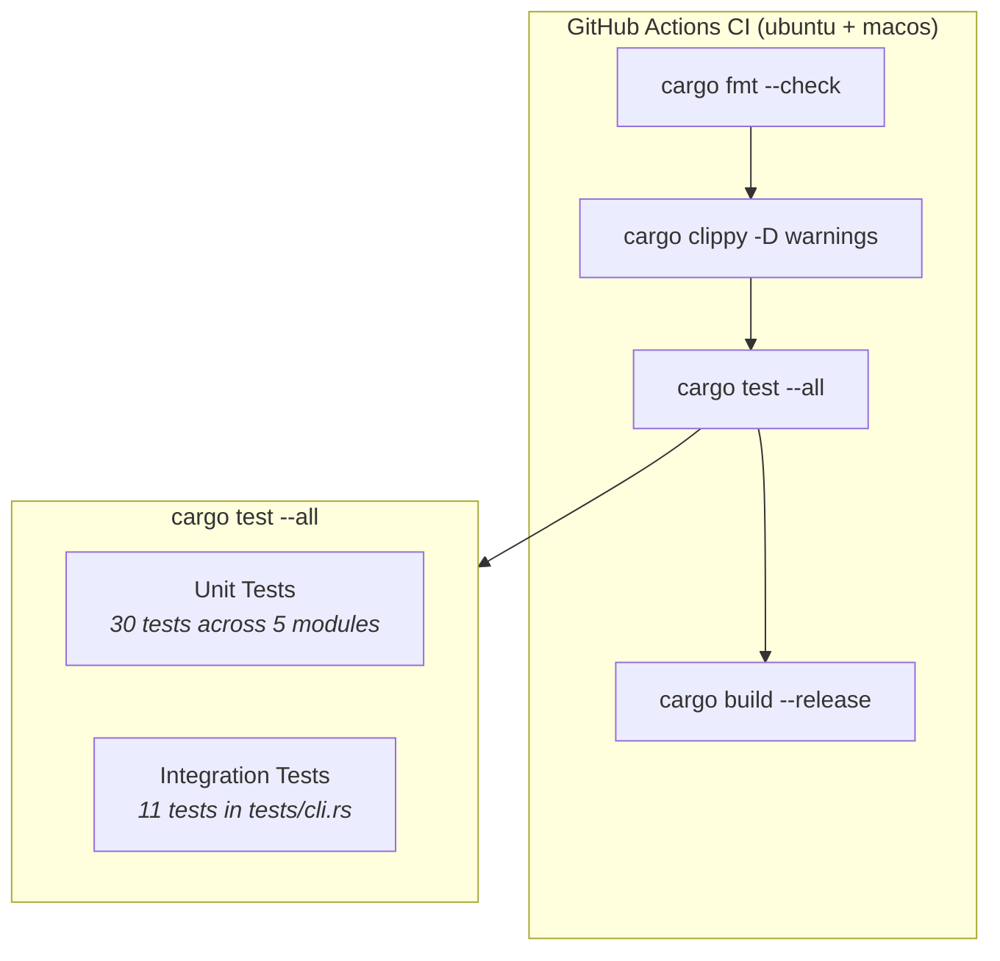
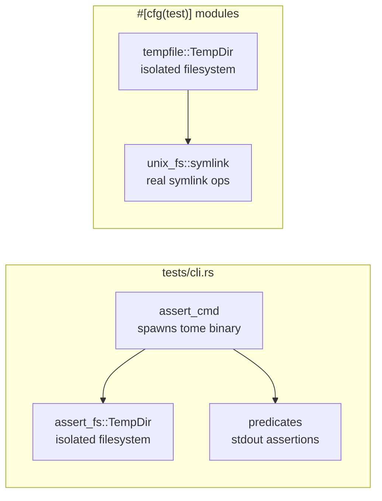
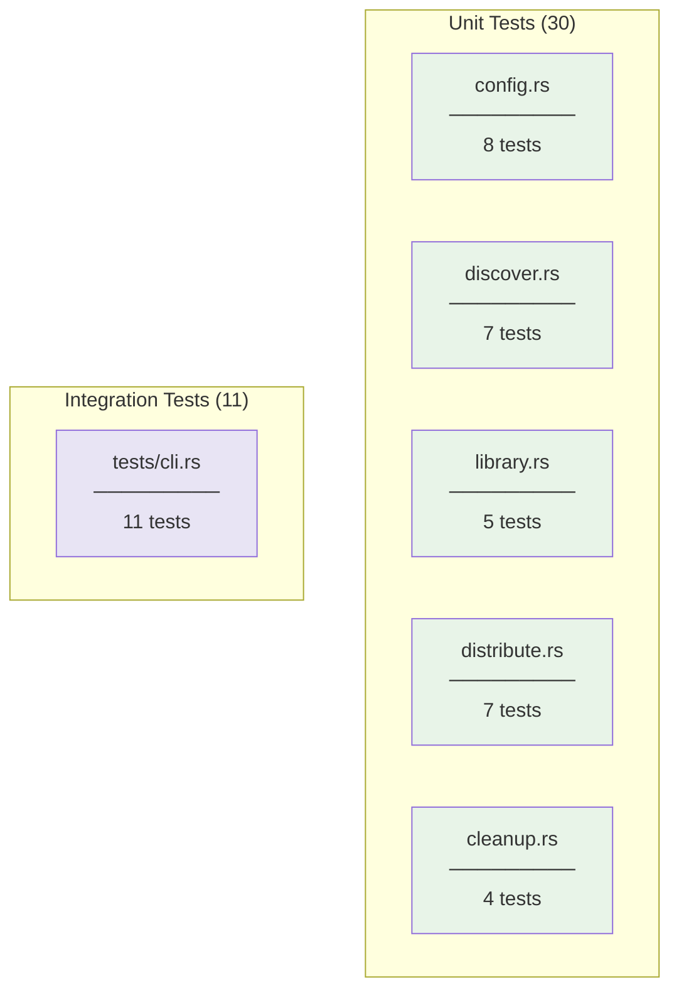
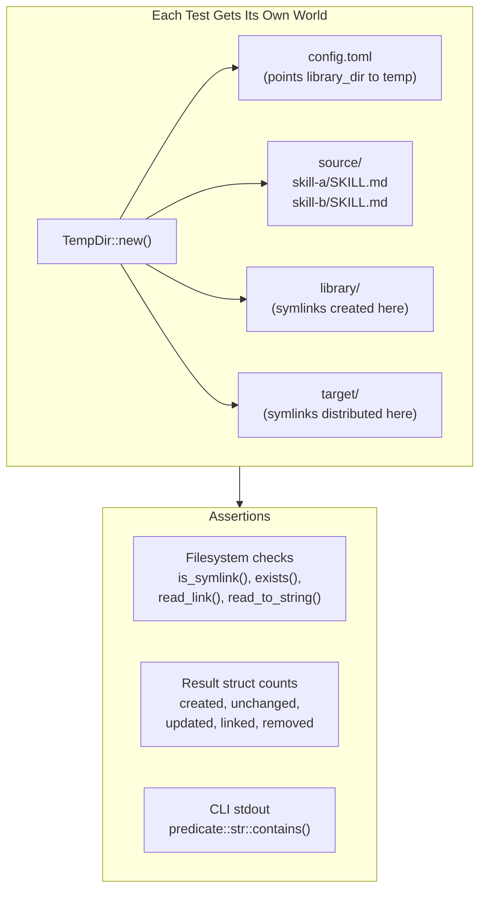
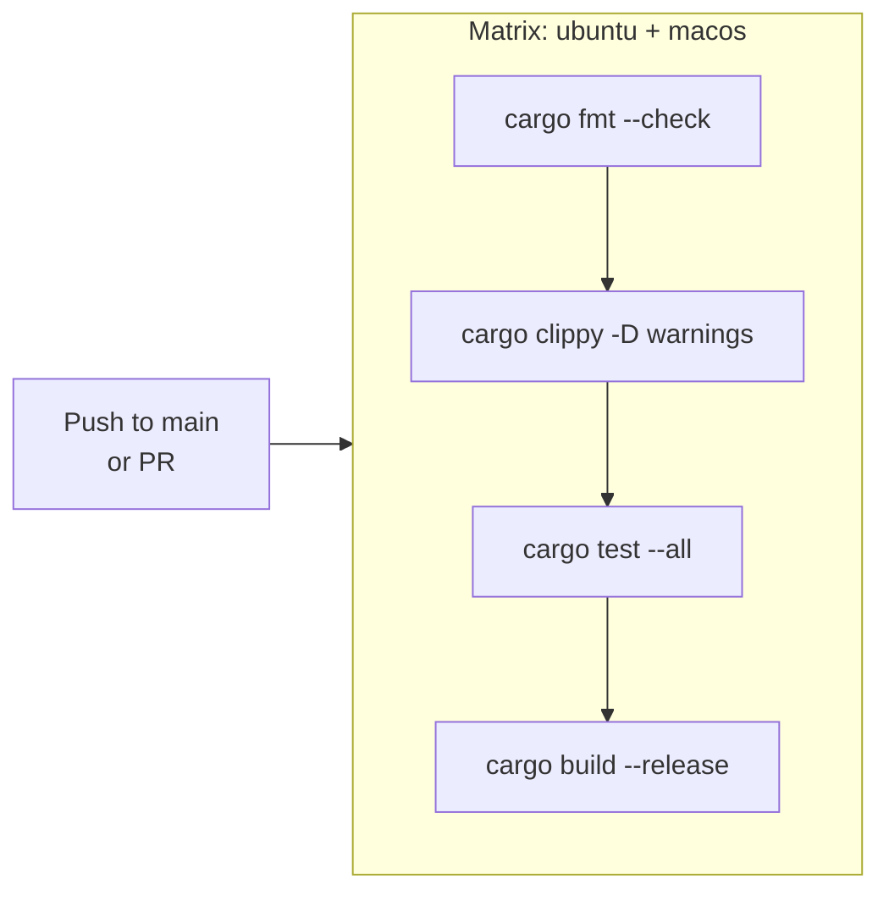

# Test Setup

tome has two layers of tests: **unit tests** co-located with each module, and **integration tests** that exercise the compiled binary end-to-end. All tests run in CI on both Ubuntu and macOS.

## Test Architecture



## Two Test Types

### Unit Tests (co-located, `#[cfg(test)]`)

Each module has a `mod tests` block that tests its public functions in isolation. These tests create temporary directories with `tempfile::TempDir` and never touch the real filesystem.

### Integration Tests (`tests/cli.rs`)

These compile the `tome` binary and run it as a subprocess using `assert_cmd`. They verify the full CLI flow: argument parsing, config loading, pipeline execution, and output formatting.



## Module-by-Module Breakdown



### `config.rs` — 8 tests

Tests config loading, serialization, tilde expansion, and error handling.

| Test | What it verifies |
|------|-----------------|
| `expand_tilde_expands_home` | `~/foo` becomes `/home/user/foo` |
| `expand_tilde_leaves_absolute_unchanged` | `/absolute/path` passes through |
| `expand_tilde_leaves_relative_unchanged` | `relative/path` passes through |
| `default_config_has_empty_sources` | `Config::default()` has no sources or exclusions |
| `config_loads_defaults_when_file_missing` | Missing file returns default config (no error) |
| `config_roundtrip_toml` | Serialize → deserialize preserves all fields |
| `config_load_fails_on_malformed_toml` | Malformed TOML returns `Err` |
| `config_parses_full_toml` | Full config string with sources + targets parses correctly |

### `discover.rs` — 7 tests

Tests skill discovery from both Directory and ClaudePlugins source types.

| Test | What it verifies |
|------|-----------------|
| `discover_directory_finds_skills` | Finds `*/SKILL.md` dirs, ignores dirs without SKILL.md |
| `discover_directory_warns_on_missing_path` | Missing source path returns empty vec (no crash) |
| `discover_all_deduplicates_first_wins` | Same skill name in two sources → first source wins |
| `discover_all_applies_exclusions` | Excluded skill names are filtered out |
| `discover_claude_plugins_reads_json` | v1 format: flat array with `installPath` |
| `discover_claude_plugins_reads_v2_json` | v2 format: `{ plugins: { "name@reg": [...] } }` |
| `discover_claude_plugins_unknown_format` | Unrecognized JSON structure returns empty vec |

### `library.rs` — 5 tests

Tests the consolidation step (symlink skills into the library directory).

| Test | What it verifies |
|------|-----------------|
| `consolidate_creates_symlinks` | New skill → symlink created, `created == 1` |
| `consolidate_idempotent` | Same skill twice → `unchanged == 1`, no filesystem change |
| `consolidate_dry_run_no_changes` | `dry_run=true` reports counts but creates no symlinks |
| `consolidate_updates_changed_target` | Skill moves to new source → symlink updated |
| `consolidate_skips_non_symlink_collision` | Regular file at link path → skipped, file untouched |

### `distribute.rs` — 7 tests

Tests the distribution step (push skills from library to target tools).

| Test | What it verifies |
|------|-----------------|
| `distribute_symlinks_creates_links` | Symlink method creates links in target dir |
| `distribute_symlinks_idempotent` | Second run → `linked=0, unchanged=1` |
| `distribute_disabled_target_is_noop` | `enabled: false` → no work done |
| `distribute_mcp_creates_config` | MCP method creates `.mcp.json` with tome entry |
| `distribute_mcp_preserves_existing_servers` | Adding tome entry doesn't clobber existing servers |
| `distribute_symlinks_skips_non_symlink_collision` | Regular file at target path → skipped, file untouched |

The `distribute_mcp_preserves_existing_servers` test also verifies idempotency on the second run.

### `cleanup.rs` — 4 tests

Tests stale symlink removal from library and target directories.

| Test | What it verifies |
|------|-----------------|
| `cleanup_removes_broken_library_symlinks` | Broken link removed, valid link preserved |
| `cleanup_dry_run_preserves_links` | `dry_run=true` counts but doesn't delete |
| `cleanup_target_removes_stale_links` | Broken target link pointing into library removed |
| `cleanup_target_preserves_external_symlinks` | Broken link pointing outside library is preserved |

### `tests/cli.rs` — 11 integration tests

Each test compiles and runs the `tome` binary in a temp directory with a custom config.

| Test | Command | What it verifies |
|------|---------|-----------------|
| `help_shows_usage` | `--help` | Prints usage text |
| `version_shows_version` | `--version` | Prints version from Cargo.toml |
| `list_with_no_sources_shows_message` | `list` | "No skills found" with empty config |
| `list_shows_discovered_skills` | `list` | Skill names + count in output |
| `sync_dry_run_makes_no_changes` | `--dry-run sync` | "Dry run" in output, library empty |
| `sync_creates_library_symlinks` | `sync` | Symlinks exist after sync |
| `sync_idempotent` | `sync` (x2) | Second run: `0 created, 1 unchanged` |
| `status_shows_library_info` | `status` | "Library:", "Sources:", "Targets:" in output |
| `config_path_prints_default_path` | `config --path` | Prints path containing `config.toml` |
| `doctor_with_clean_state` | `doctor` | "No issues found" |
| `doctor_detects_broken_symlinks` | `doctor` | "1 issue(s)" with planted broken symlink |

## Filesystem Isolation Strategy

Every test creates its own `TempDir` that is automatically cleaned up when the test ends. This means:

- Tests never interfere with each other (no shared state)
- Tests never touch the real `~/.config/tome/` or `~/.local/share/tome/`
- No manual cleanup is needed
- Tests can run in parallel safely



## Test Dependencies

Defined in the workspace `Cargo.toml` and used via `[dev-dependencies]`:

| Crate | Version | Purpose |
|-------|---------|---------|
| `tempfile` | 3 | `TempDir` for filesystem isolation in unit tests |
| `assert_cmd` | 2 | Run compiled binary as subprocess in integration tests |
| `assert_fs` | 1 | `TempDir` for integration tests (compatible with assert_cmd) |
| `predicates` | 3 | Composable stdout/stderr assertions (`contains`, `and`, etc.) |

## How to Run Tests

```bash
# All tests (unit + integration)
make test              # or: cargo test

# Just one crate
cargo test -p tome

# A specific test by name
cargo test test_name

# Tests in a specific module
cargo test -p tome -- discover::tests

# Only integration tests
cargo test -p tome --test cli

# With output (see println! from tests)
cargo test -- --nocapture
```

## CI Pipeline

GitHub Actions runs on every push to `main` and every PR, on both `ubuntu-latest` and `macos-latest`:



The full pipeline is defined in `.github/workflows/ci.yml`. Running it locally is equivalent to:

```bash
make ci    # runs: fmt-check + lint + test
```

## What's Not Tested

A few modules have no unit tests because they're inherently interactive or side-effect-heavy:

- **`wizard.rs`** — Interactive prompts via `dialoguer` (would need mocking)
- **`doctor.rs`** — Thin wrapper; behavior covered by integration tests
- **`status.rs`** — Output formatting only; covered by integration `status_shows_library_info`
- **`mcp.rs`** — Async MCP server (would need an MCP client test harness)
- **`lib.rs`** — Orchestration glue; covered by integration tests
