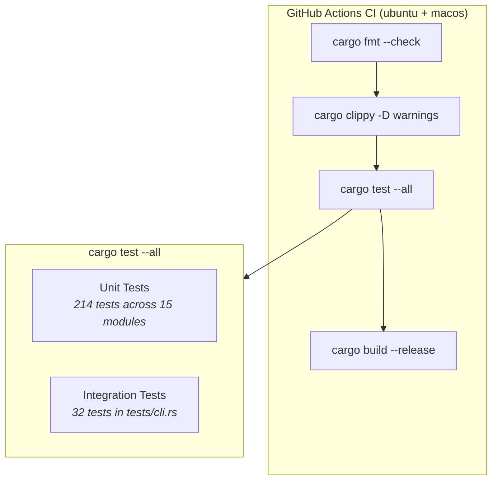
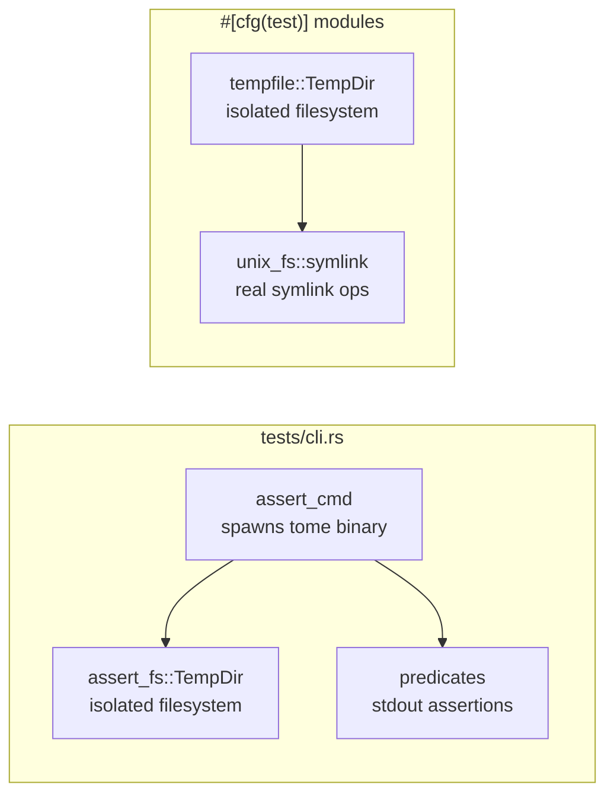
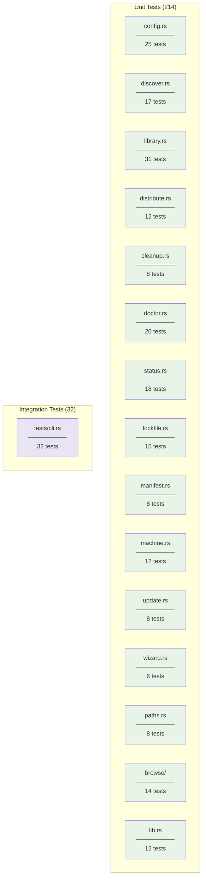
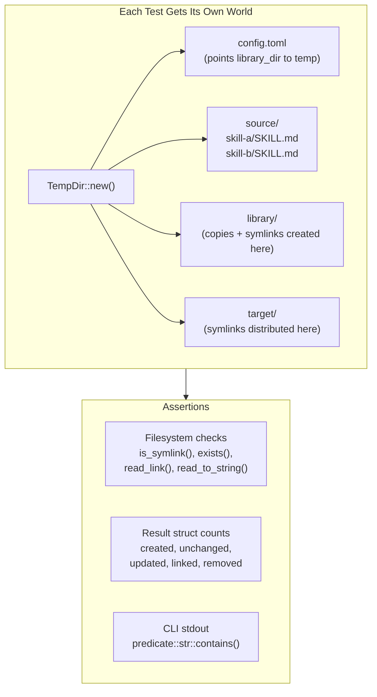
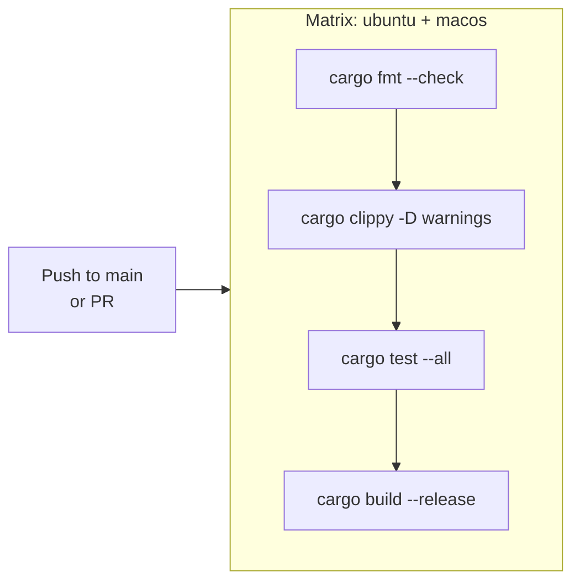

# Test Setup

tome has two layers of tests: **unit tests** co-located with each module, and **integration tests** that exercise the compiled binary end-to-end. All tests run in CI on both Ubuntu and macOS.

## Test Architecture


```mermaid
graph TB
    subgraph CI["GitHub Actions CI (ubuntu + macos)"]
        FMT["cargo fmt --check"]
        CLIP["cargo clippy -D warnings"]
        TEST["cargo test --all"]
        BUILD["cargo build --release"]
        FMT --> CLIP --> TEST --> BUILD
    end

    subgraph TEST_SUITE["cargo test --all"]
        UNIT["Unit Tests<br/><i>214 tests across 15 modules</i>"]
        INTEG["Integration Tests<br/><i>32 tests in tests/cli.rs</i>"]
    end

    TEST --> TEST_SUITE
```

## Two Test Types

### Unit Tests (co-located, `#[cfg(test)]`)

Each module has a `mod tests` block that tests its public functions in isolation. These tests create temporary directories with `tempfile::TempDir` and never touch the real filesystem.

### Integration Tests (`tests/cli.rs`)

These compile the `tome` binary and run it as a subprocess using `assert_cmd`. They verify the full CLI flow: argument parsing, config loading, pipeline execution, and output formatting.


```mermaid
graph LR
    subgraph Integration["tests/cli.rs"]
        CMD["assert_cmd<br/>spawns tome binary"]
        TMP["assert_fs::TempDir<br/>isolated filesystem"]
        PRED["predicates<br/>stdout assertions"]
        CMD --> TMP
        CMD --> PRED
    end

    subgraph Unit["#[cfg(test)] modules"]
        TEMP["tempfile::TempDir<br/>isolated filesystem"]
        SYML["unix_fs::symlink<br/>real symlink ops"]
        TEMP --> SYML
    end
```

## Module-by-Module Breakdown

> **Note:** Test counts below reflect a point-in-time snapshot. Run `cargo test` for current counts.


```mermaid
graph TB
    subgraph unit_tests["Unit Tests (214)"]
        CONFIG["config.rs<br/>─────────<br/>25 tests"]
        DISCOVER["discover.rs<br/>─────────<br/>17 tests"]
        LIBRARY["library.rs<br/>─────────<br/>31 tests"]
        DISTRIBUTE["distribute.rs<br/>─────────<br/>12 tests"]
        CLEANUP["cleanup.rs<br/>─────────<br/>8 tests"]
        DOCTOR["doctor.rs<br/>─────────<br/>20 tests"]
        STATUS["status.rs<br/>─────────<br/>18 tests"]
        LOCKFILE["lockfile.rs<br/>─────────<br/>15 tests"]
        MANIFEST["manifest.rs<br/>─────────<br/>8 tests"]
        MACHINE["machine.rs<br/>─────────<br/>12 tests"]
        UPDATE["update.rs<br/>─────────<br/>8 tests"]
        WIZARD["wizard.rs<br/>─────────<br/>6 tests"]
        PATHS["paths.rs<br/>─────────<br/>8 tests"]
        BROWSE["browse/<br/>─────────<br/>14 tests"]
        LIB["lib.rs<br/>─────────<br/>12 tests"]
    end

    subgraph integration_tests["Integration Tests (32)"]
        CLI["tests/cli.rs<br/>─────────<br/>32 tests"]
    end

    style CONFIG fill:#e8f4e8
    style DISCOVER fill:#e8f4e8
    style LIBRARY fill:#e8f4e8
    style DISTRIBUTE fill:#e8f4e8
    style CLEANUP fill:#e8f4e8
    style DOCTOR fill:#e8f4e8
    style STATUS fill:#e8f4e8
    style LOCKFILE fill:#e8f4e8
    style MANIFEST fill:#e8f4e8
    style MACHINE fill:#e8f4e8
    style UPDATE fill:#e8f4e8
    style WIZARD fill:#e8f4e8
    style PATHS fill:#e8f4e8
    style BROWSE fill:#e8f4e8
    style LIB fill:#e8f4e8
    style CLI fill:#e8e4f4
```

### `config.rs` — 25 tests

Tests config loading, serialization, tilde expansion, validation, and target parsing.

| Test | What it verifies |
|------|-----------------|
| `expand_tilde_expands_home` | `~/foo` becomes `/home/user/foo` |
| `expand_tilde_leaves_absolute_unchanged` | `/absolute/path` passes through |
| `expand_tilde_leaves_relative_unchanged` | `relative/path` passes through |
| `default_config_has_empty_sources` | `Config::default()` has no sources or exclusions |
| `config_loads_defaults_when_file_missing` | Missing file returns default config (no error) |
| `config_roundtrip_toml` | Serialize -> deserialize preserves all fields |
| `config_load_fails_on_malformed_toml` | Malformed TOML returns `Err` |
| `config_parses_full_toml` | Full config string with sources + targets parses correctly |
| `config_parses_arbitrary_target_name` | Custom target names work in BTreeMap |
| `config_parses_claude_target_from_toml` | Claude-specific target fields parse correctly |
| `config_roundtrip_claude_target` | Claude target serialization roundtrip |
| `load_or_default_errors_when_parent_dir_missing` | Missing parent dir returns error |
| `load_or_default_returns_defaults_when_parent_exists` | Existing parent dir with no file returns defaults |
| `target_config_roundtrip_symlink` | Symlink target serialization roundtrip |
| `targets_iter_includes_claude` | Claude target included in iterator |
| `try_from_raw_rejects_unknown_method` | Unknown method string rejected |
| `try_from_raw_rejects_symlink_without_skills_dir` | Symlink target requires `skills_dir` field |
| `validate_passes_for_valid_config` | Valid config passes validation |
| `validate_rejects_duplicate_source_names` | Duplicate source names rejected |
| `validate_rejects_empty_source_name` | Empty source name rejected |
| `validate_rejects_library_dir_that_is_a_file` | Library dir pointing to a file rejected |
| `target_name_accepts_valid` | Valid target names pass validation |
| `target_name_rejects_empty` | Empty target name rejected |
| `target_name_rejects_path_separator` | Target names with `/` rejected |
| `target_name_deserialize_rejects_empty` | Empty target name rejected during deserialization |

### `discover.rs` — 17 tests

Tests skill discovery from both Directory and ClaudePlugins source types, plus skill name validation.

| Test | What it verifies |
|------|-----------------|
| `discover_directory_finds_skills` | Finds `*/SKILL.md` dirs, ignores dirs without SKILL.md |
| `discover_directory_warns_on_missing_path` | Missing source path returns empty vec (no crash) |
| `discover_directory_skips_skill_md_at_source_root` | SKILL.md directly in source root is ignored |
| `discover_all_deduplicates_first_wins` | Same skill name in two sources -> first source wins |
| `discover_all_applies_exclusions` | Excluded skill names are filtered out |
| `discover_all_collects_dedup_warnings` | Deduplication produces warnings |
| `discover_all_collects_naming_warnings` | Naming issues produce warnings |
| `discover_all_with_partial_config_returns_skills` | Works with incomplete config |
| `discover_claude_plugins_reads_json` | v1 format: flat array with `installPath` |
| `discover_claude_plugins_reads_v2_json` | v2 format: `{ plugins: { "name@reg": [...] } }` |
| `discover_claude_plugins_unknown_format` | Unrecognized JSON structure returns empty vec |
| `discover_claude_plugins_deduplicates_within_source` | Same plugin listed twice in JSON -> deduplicated |
| `discover_claude_plugins_v1_no_provenance` | v1 format skills have no provenance metadata |
| `skill_name_accepts_valid` | Valid skill names pass validation |
| `skill_name_rejects_empty` | Empty name rejected |
| `skill_name_rejects_path_separator` | Names with `/` rejected |
| `skill_name_conventional_check` | Naming convention warnings |

### `library.rs` — 31 tests

Tests the consolidation step — copying local skills and symlinking managed skills into the library.

| Test | What it verifies |
|------|-----------------|
| `consolidate_copies_skills` | Local skill -> copied into library |
| `consolidate_copies_nested_subdirectories` | Nested dirs within skills are preserved |
| `consolidate_idempotent` | Same skill twice -> `unchanged == 1`, no filesystem change |
| `consolidate_dry_run_no_changes` | `dry_run=true` reports counts but creates nothing |
| `consolidate_dry_run_doesnt_create_dir` | Library dir not created during dry run |
| `consolidate_dry_run_no_manifest_written` | Manifest not written during dry run |
| `consolidate_dry_run_manifest_reflects_would_be_state` | Dry run manifest shows expected state |
| `consolidate_updates_changed_source` | Changed source content -> library copy updated |
| `consolidate_detects_content_change` | Content hash change triggers re-copy |
| `consolidate_skips_unmanaged_collision` | Existing non-managed dir not overwritten |
| `consolidate_force_recopies` | `force=true` re-copies even if unchanged |
| `consolidate_local_manifest_reflects_update` | Manifest updated after local skill change |
| `consolidate_manifest_persisted` | Manifest written to disk |
| `consolidate_symlinks_managed_skill` | Managed skill -> symlinked into library |
| `consolidate_managed_idempotent` | Managed skill symlink is idempotent |
| `consolidate_managed_path_changed` | Source path change -> symlink updated |
| `consolidate_managed_dry_run_no_symlink_created` | Managed dry run creates no symlinks |
| `consolidate_managed_force_recreates_symlink` | Force recreates managed symlinks |
| `consolidate_managed_skips_non_manifest_dir_collision` | Non-manifest dir collision handled |
| `consolidate_managed_manifest_records_managed_flag` | Manifest records managed flag |
| `consolidate_managed_repairs_stale_directory` | Stale directory state repaired to symlink |
| `consolidate_migrates_v01_symlink` | v0.1 symlinks migrated to copies |
| `consolidate_migrates_v01_symlink_records_discovered_source` | Migration records source provenance |
| `consolidate_migrates_v01_symlink_with_broken_target` | Broken v0.1 symlink migrated gracefully |
| `consolidate_strategy_transition_local_to_managed` | Local -> managed strategy transition |
| `consolidate_strategy_transition_managed_to_local` | Managed -> local strategy transition |
| `gitignore_lists_managed_skills` | `.gitignore` lists managed skill dirs |
| `gitignore_does_not_list_local_skills` | `.gitignore` excludes local skills |
| `gitignore_idempotent` | Repeated gitignore writes are idempotent |
| `gitignore_always_ignores_tmp_files` | `.gitignore` includes `*.tmp` pattern |

### `distribute.rs` — 12 tests

Tests the distribution step — pushing skills from library to target tools.

| Test | What it verifies |
|------|-----------------|
| `distribute_symlinks_creates_links` | Symlink method creates links in target dir |
| `distribute_symlinks_idempotent` | Second run -> `linked=0, unchanged=1` |
| `distribute_symlinks_force_recreates_links` | Force recreates all links |
| `distribute_symlinks_updates_stale_link` | Stale link pointing elsewhere updated |
| `distribute_symlinks_skips_non_symlink_collision` | Regular file at target path -> skipped |
| `distribute_symlinks_skips_manifest_file` | `.tome-manifest.json` not distributed |
| `distribute_symlinks_dry_run_doesnt_create_dir` | Target dir not created during dry run |
| `distribute_symlinks_dry_run_with_nonexistent_library` | Dry run works with missing library |
| `distribute_disabled_target_is_noop` | `enabled: false` -> no work done |
| `distribute_skips_disabled_skills` | Machine-disabled skills not distributed |
| `distribute_skips_skills_originating_from_target_dir` | Skills from target's own dir skipped |
| `distribute_idempotent_with_canonicalized_paths` | Idempotent with canonicalized paths |

### `cleanup.rs` — 8 tests

Tests stale symlink and manifest cleanup from library and targets.

| Test | What it verifies |
|------|-----------------|
| `cleanup_removes_stale_manifest_entries` | Manifest entries for missing skills removed |
| `cleanup_removes_broken_legacy_symlinks` | Broken legacy symlinks cleaned up |
| `cleanup_removes_managed_symlink` | Stale managed symlinks removed |
| `cleanup_preserves_current_skills` | Active skills preserved during cleanup |
| `cleanup_dry_run_preserves_stale` | Dry run counts but doesn't delete |
| `cleanup_target_removes_stale_links` | Broken target links removed |
| `cleanup_target_dry_run_preserves_stale_links` | Target dry run preserves links |
| `cleanup_target_preserves_external_symlinks` | Links pointing outside library preserved |

### `doctor.rs` — 20 tests

Tests library diagnostics and repair.

| Test | What it verifies |
|------|-----------------|
| `check_healthy_library_returns_no_issues` | Clean library has no issues |
| `check_detects_orphan_directory` | Orphan dir (not in manifest) detected |
| `check_detects_missing_source_path` | Missing source path flagged |
| `check_library_no_issues` | Healthy library check passes |
| `check_library_orphan_directory` | Orphan directory in library detected |
| `check_library_missing_manifest_entry` | Missing manifest entry detected |
| `check_library_broken_legacy_symlink` | Broken legacy symlink detected |
| `check_library_missing_dir` | Missing library dir handled |
| `check_config_valid_sources` | Valid source config passes |
| `check_config_missing_source` | Missing source config flagged |
| `check_target_dir_stale_symlink` | Stale target symlink detected |
| `check_target_dir_missing_dir` | Missing target dir handled |
| `check_target_dir_ignores_external_symlinks` | External symlinks ignored |
| `check_unconfigured_returns_not_configured` | Unconfigured state detected |
| `diagnose_shows_init_prompt_when_unconfigured` | Shows init prompt when no config |
| `repair_library_healthy_is_noop` | Repair on healthy library is no-op |
| `repair_library_removes_orphan_manifest_entry` | Repair removes orphan manifest entries |
| `repair_library_removes_broken_legacy_symlink` | Repair removes broken legacy symlinks |
| `repair_library_removes_broken_managed_symlink` | Repair removes broken managed symlinks |

### `lockfile.rs` — 15 tests

Tests lockfile generation, loading, and serialization.

| Test | What it verifies |
|------|-----------------|
| `generate_empty_manifest` | Empty manifest produces empty lockfile |
| `generate_managed_skill_with_provenance` | Managed skills include provenance |
| `generate_local_skill_no_provenance` | Local skills omit registry fields |
| `generate_discovered_skill_not_in_manifest` | Discovered skill without manifest entry handled |
| `generate_manifest_entry_without_discovered_skill` | Manifest entry without discovered skill handled |
| `generate_mixed_skills` | Mix of managed and local skills |
| `deterministic_output` | Output is deterministic (sorted) |
| `roundtrip_serialization` | Serialize -> deserialize roundtrip |
| `save_creates_file` | Save creates lockfile on disk |
| `save_does_not_leave_tmp_file` | Atomic write cleans up temp file |
| `load_missing_file_returns_none` | Missing lockfile returns None |
| `load_valid_file_returns_some` | Valid lockfile loads successfully |
| `load_corrupt_file_returns_error` | Corrupt lockfile returns error |
| `empty_version_string_becomes_none` | Empty version string normalized to None |
| `local_skill_omits_registry_fields_in_json` | Local skills omit registry fields in JSON |

### `machine.rs` — 12 tests

Tests per-machine preferences loading, saving, and disabled skill/target tracking.

| Test | What it verifies |
|------|-----------------|
| `default_prefs_has_empty_disabled` | Default prefs have empty disabled set |
| `is_disabled_checks_set` | `is_disabled()` checks the disabled set |
| `load_missing_file_returns_defaults` | Missing file returns defaults |
| `load_malformed_toml_returns_error` | Malformed TOML returns error |
| `save_load_roundtrip` | Save -> load roundtrip preserves state |
| `save_creates_parent_directories` | Save creates parent dirs if needed |
| `save_does_not_leave_tmp_file` | Atomic write cleans up temp file |
| `toml_format_is_readable` | Serialized TOML is human-readable |

> Run `cargo test -p tome -- machine::tests --list` for the full current list.

### `manifest.rs` — 8 tests

Tests library manifest operations and content hashing.

| Test | What it verifies |
|------|-----------------|
| `load_missing_manifest_returns_empty` | Missing manifest returns empty map |
| `load_corrupt_json_returns_error` | Corrupt JSON returns error |
| `manifest_roundtrip` | Save -> load roundtrip |
| `hash_directory_deterministic` | Same content produces same hash |
| `hash_directory_changes_with_content` | Changed content produces different hash |
| `hash_directory_different_filenames_different_hashes` | Different filenames produce different hashes |
| `hash_directory_includes_subdirs` | Subdirectory contents included in hash |
| `now_iso8601_format` | Timestamp format is ISO 8601 |

### `status.rs` — 18 tests

Tests status gathering and health checks.

| Test | What it verifies |
|------|-----------------|
| `count_entries_counts_directories` | Counts directories in library |
| `count_entries_empty_dir` | Empty dir returns 0 |
| `count_entries_ignores_hidden_directories` | Hidden dirs (`.foo`) excluded |
| `count_entries_ignores_regular_files` | Regular files excluded from count |
| `count_health_issues_empty_dir` | Empty dir has no health issues |
| `count_health_issues_ignores_hidden_dirs` | Hidden dirs excluded from health check |
| `count_health_issues_detects_orphan_directory` | Orphan directory detected |
| `count_health_issues_detects_manifest_disk_mismatch` | Manifest/disk mismatch detected |
| `gather_unconfigured_returns_not_configured` | Unconfigured state detected |
| `gather_with_library_dir_counts_skills` | Library dir skill count |
| `gather_with_sources_marks_configured` | Sources marked as configured |
| `gather_with_targets_populates_target_status` | Target status populated |
| `gather_health_detects_orphan` | Health check detects orphan dirs |
| `status_shows_init_prompt_when_unconfigured` | Shows init prompt when unconfigured |
| `status_shows_tables_with_configured_sources_and_targets` | Full status output with tables |
| `status_warns_when_library_missing_but_sources_configured` | Warning when library dir missing |

### `update.rs` — 8 tests

Tests lockfile diffing and triage logic used by `tome sync`.

| Test | What it verifies |
|------|-----------------|
| `diff_empty_lockfiles` | Two empty lockfiles produce no changes |
| `diff_identical_lockfiles` | Identical lockfiles produce no changes |
| `diff_added_skill` | New skill detected as added |
| `diff_removed_skill` | Missing skill detected as removed |
| `diff_changed_skill` | Changed hash detected as changed |
| `diff_same_hash_different_source_is_unchanged` | Same hash with different source is unchanged |
| `diff_mixed_changes` | Mix of added/removed/changed/unchanged |
| `diff_detects_managed_skill` | Managed skills flagged in diff |

### `wizard.rs` — 6 tests

Tests wizard auto-discovery and overlap detection.

| Test | What it verifies |
|------|-----------------|
| `find_known_sources_in_discovers_existing_dirs` | Auto-discovers known source paths |
| `find_known_sources_in_empty_home_returns_empty` | Empty home returns no sources |
| `find_known_sources_in_skips_files_with_same_name` | Files with source dir names skipped |
| `detects_source_target_overlap` | Source/target path overlap detected |
| `detects_claude_source_target_overlap` | Claude-specific overlap detected |
| `no_overlap_when_paths_differ` | Distinct paths pass overlap check |

### `lib.rs` — 12 tests

Tests orchestration-level functions (disabled skill cleanup, commit message generation, tome home resolution).

| Test | What it verifies |
|------|-----------------|
| `cleanup_disabled_removes_library_symlink` | Disabled skill symlink removed from target |
| `cleanup_disabled_preserves_external_symlink` | Non-library symlinks preserved |
| `cleanup_disabled_skips_non_symlink` | Regular files not removed |
| `cleanup_disabled_dry_run_preserves_symlink` | Dry run preserves symlinks |
| `cleanup_disabled_nonexistent_dir_returns_zero` | Missing dir returns 0 |
| `commit_message_all_changes` | Commit message with all change types |
| `commit_message_created_only` | Commit message with creates only |
| `commit_message_no_changes` | Commit message with no changes |
| `resolve_tome_home_absolute_path_returns_parent` | Absolute path resolves to parent |
| `resolve_tome_home_none_returns_default` | None returns default home |
| `resolve_tome_home_relative_path_returns_error` | Relative path rejected |
| `resolve_tome_home_bare_filename_returns_error` | Bare filename rejected |

### `tests/cli.rs` — 32 integration tests

Each test compiles and runs the `tome` binary in a temp directory with a custom config.

| Test | Command | What it verifies |
|------|---------|-----------------|
| `help_shows_usage` | `--help` | Prints usage text |
| `version_shows_version` | `--version` | Prints version from Cargo.toml |
| `list_with_no_sources_shows_message` | `list` | "No skills found" with empty config |
| `list_shows_discovered_skills` | `list` | Skill names + count in output |
| `list_json_outputs_valid_json` | `list --json` | Valid JSON array output |
| `list_json_with_no_skills_outputs_empty_array` | `list --json` | Empty array when no skills |
| `list_json_with_quiet_still_outputs_json` | `list --json -q` | JSON output even in quiet mode |
| `sync_dry_run_makes_no_changes` | `--dry-run sync` | "Dry run" in output, library empty |
| `sync_copies_skills_to_library` | `sync` | Skills copied to library dir |
| `sync_creates_lockfile` | `sync` | `tome.lock` created |
| `sync_dry_run_does_not_create_lockfile` | `--dry-run sync` | No lockfile in dry run |
| `sync_distributes_to_symlink_target` | `sync` | Symlinks created in target dir |
| `sync_idempotent` | `sync` (x2) | Second run: `0 created, 1 unchanged` |
| `sync_updates_changed_source` | `sync` (x2) | Changed source content triggers update |
| `sync_force_recreates_all` | `sync --force` | Force re-copies all skills |
| `sync_migrates_v01_symlinks` | `sync` | Legacy v0.1 symlinks migrated |
| `sync_lifecycle_cleans_up_removed_skills` | `sync` (x2) | Removed source -> cleaned up |
| `sync_respects_machine_disabled` | `sync` | Disabled skills not distributed |
| `sync_respects_machine_disabled_targets` | `sync` | Disabled targets skipped during sync |
| `sync_dry_run_skips_git_commit` | `--dry-run sync` | No git commit in dry run |
| `sync_quiet_skips_git_commit` | `-q sync` | No git commit in quiet mode |
| `sync_skips_git_commit_without_tty` | `sync` | No git commit without TTY |
| `status_shows_library_info` | `status` | "Library:", "Sources:", "Targets:" in output |
| `status_without_config_shows_init_prompt` | `status` | Init prompt when unconfigured |
| `config_path_prints_default_path` | `config --path` | Prints path containing `config.toml` |
| `doctor_with_clean_state` | `doctor` | "No issues found" |
| `doctor_detects_broken_symlinks` | `doctor` | Issues detected with broken symlink |
| `doctor_without_config_shows_init_prompt` | `doctor` | Init prompt when unconfigured |
| `update_shows_new_skills` | `update` | New skills shown after initial sync |
| `update_dry_run_makes_no_changes` | `--dry-run update` | Dry run preserves state |
| `update_with_no_lockfile_works_gracefully` | `update` | Works without existing lockfile |
| `update_disable_removes_symlink` | `update` | Disabled skill symlink removed |

## Filesystem Isolation Strategy

Every test creates its own `TempDir` that is automatically cleaned up when the test ends. This means:

- Tests never interfere with each other (no shared state)
- Tests never touch the real `~/.tome/`
- No manual cleanup is needed
- Tests can run in parallel safely


```mermaid
graph TB
    subgraph test_env["Each Test Gets Its Own World"]
        TD["TempDir::new()"]
        TD --> CONFIG_FILE["config.toml<br/>(points library_dir to temp)"]
        TD --> SOURCE_DIR["source/<br/>skill-a/SKILL.md<br/>skill-b/SKILL.md"]
        TD --> LIBRARY_DIR["library/<br/>(copies + symlinks created here)"]
        TD --> TARGET_DIR["target/<br/>(symlinks distributed here)"]
    end

    subgraph assertions["Assertions"]
        FS["Filesystem checks<br/>is_symlink(), exists(),<br/>read_link(), read_to_string()"]
        COUNTS["Result struct counts<br/>created, unchanged,<br/>updated, linked, removed"]
        OUTPUT["CLI stdout<br/>predicate::str::contains()"]
    end

    test_env --> assertions
```

## Test Dependencies

Defined in the workspace `Cargo.toml` and used via `[dev-dependencies]`:

| Crate | Version | Purpose |
|-------|---------|---------|
| `tempfile` | 3 | `TempDir` for filesystem isolation in unit tests |
| `assert_cmd` | 2 | Run compiled binary as subprocess in integration tests |
| `assert_fs` | 1 | `TempDir` for integration tests (compatible with assert_cmd) |
| `predicates` | 3 | Composable stdout/stderr assertions (`contains`, `and`, etc.) |

## How to Run Tests

```bash
# All tests (unit + integration)
make test              # or: cargo test

# Just one crate
cargo test -p tome

# A specific test by name
cargo test test_name

# Tests in a specific module
cargo test -p tome -- discover::tests

# Only integration tests
cargo test -p tome --test cli

# With output (see println! from tests)
cargo test -- --nocapture
```

## CI Pipeline

GitHub Actions runs on every push to `main` and every PR, on both `ubuntu-latest` and `macos-latest`:


```mermaid
graph LR
    subgraph matrix["Matrix: ubuntu + macos"]
        A["cargo fmt --check"] --> B["cargo clippy -D warnings"]
        B --> C["cargo test --all"]
        C --> D["cargo build --release"]
    end

    PUSH["Push to main<br/>or PR"] --> matrix
```

The full pipeline is defined in `.github/workflows/ci.yml`. Running it locally is equivalent to:

```bash
make ci    # runs: fmt-check + lint + test
```
