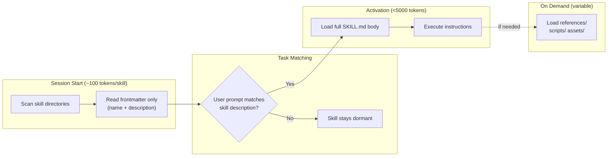
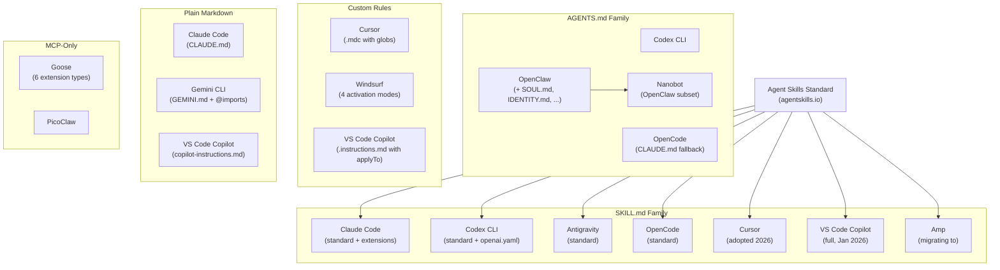
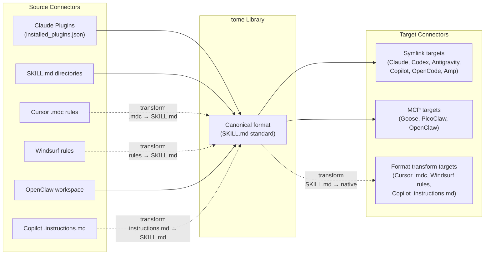

# AI Coding Tool Landscape

Research into agent file formats (skills, rules, memory, hooks, agents, plugins), invocation methods, context loading strategies, and format differences across AI coding tools — informing tome's connector architecture.

*Last updated: February 2026*

---

## 1. The Full Taxonomy

AI coding tools have up to **seven layers** of configuration. Most discussions focus on the first three, but the extended structures (hooks, agents, plugins, MCP) are where the real divergence happens.

| Layer | Purpose | Portable? | Who Has It |
|-------|---------|-----------|-----------|
| **Skills** | Reusable instructions activated on demand | Yes (SKILL.md standard, 20+ tools) | Claude, Codex, Copilot, Antigravity, Cursor, OpenCode, Amp, Goose |
| **Rules** | Always-on project/global conventions | Partially (markdown, but different filenames/formats) | All tools |
| **Memory** | Learned context persisted across sessions | No (completely tool-specific) | Claude, Codex, Cursor, Windsurf, Copilot, OpenClaw |
| **Hooks** | Lifecycle event handlers | No (tool-specific JSON/config) | Claude (12 events), Codex, Windsurf, Amp |
| **Agents** | Isolated subagents with custom tools/model | No (tool-specific markdown/YAML) | Claude, Codex, Copilot, Cursor, Antigravity |
| **Plugins** | Bundles of skills + agents + hooks + MCP | No (tool-specific manifests) | Claude, Cursor, Amp |
| **MCP Servers** | External tool integrations via protocol | Yes (MCP is an open standard) | All major tools |

**Key insight:** Skills and MCP are the two truly portable layers. Everything else is tool-specific.

---

## 2. Tool-by-Tool Breakdown

### Claude Code

**Vendor:** Anthropic | **Type:** CLI agent | **SKILL.md:** Full standard + extensions

| Aspect | Details |
|--------|---------|
| **Instruction file** | `CLAUDE.md` (project root, `~/.claude/CLAUDE.md` global) |
| **Skills** | SKILL.md with extended frontmatter (`disable-model-invocation`, `context: fork`, `agent`, `hooks`, `argument-hint`) |
| **Rules** | `.claude/rules/` directory (markdown files) |
| **Memory** | `.claude/memory/MEMORY.md` (auto-loaded), additional topic files |
| **Other files** | Plugins (`plugin.json`), Agents (`.claude/agents/*.md`), Hooks (`hooks.json`) |
| **Skill discovery** | Personal (`~/.claude/skills/`), Project (`.claude/skills/`), Plugin, Enterprise, nested `.claude/skills/` in subdirectories |
| **Invocation** | `/skill-name` (slash command), `Skill(skill: "name")` (tool call), implicit model invocation |
| **Context loading** | Description always in context (2% of window budget); full content on invocation; `context: fork` runs in subagent |

**Unique skill extensions** beyond the standard:
- `disable-model-invocation: true` — user-only invocation
- `user-invocable: false` — model-only (background knowledge)
- `context: fork` + `agent: Explore` — run skill in isolated subagent
- `` `!command` `` syntax — inject shell output into skill content before sending to model
- `$ARGUMENTS`, `$0`, `$1` — argument substitution
- `hooks` — lifecycle hooks scoped to the skill

**Extended structures:**
- **Hooks** — 12 lifecycle events (SessionStart, PreToolUse, PostToolUse, Stop, etc.) with 3 hook types: `command`, `prompt`, `agent`. Configured in `settings.json` at global/project/local levels.
- **Agents** — `.claude/agents/*.md` with YAML frontmatter (11+ fields: `tools`, `model`, `maxTurns`, `hooks`, `mcpServers`, `permissionMode`, etc.). Isolated subagents with own context/tools/model.
- **Plugins** — `plugin.json` manifest bundling skills + agents + hooks + MCP + LSP servers + output styles. Marketplace discovery via `/plugin`. Three install scopes: user/project/local.
- **Commands** — `.claude/commands/*.md` (legacy, superseded by skills but still supported). Simple markdown, no frontmatter.
- **Settings** — Three-level hierarchy: `~/.claude/settings.json` → `.claude/settings.json` → `.claude/settings.local.json`. Permissions, hooks, MCP servers. JSON schema available.
- **MCP** — `.mcp.json` at project root or in settings. Supports stdio/http/sse. Env var expansion: `${VAR}`, `${VAR:-default}`.

---

### Codex CLI

**Vendor:** OpenAI | **Type:** CLI agent | **SKILL.md:** Standard + `agents/openai.yaml`

| Aspect | Details |
|--------|---------|
| **Instruction file** | `AGENTS.md` (project root), `AGENTS.override.md` takes priority |
| **Skills** | SKILL.md (standard) + optional `agents/openai.yaml` for UI metadata and invocation policy |
| **Rules** | Via AGENTS.md content |
| **Memory** | Session transcripts in `~/.codex/history.jsonl`. Resume subcommand. TUI: `/m_update`, `/m_drop`. Initial plumbing in v0.97.0 (Feb 2026). |
| **Hooks** | "Notify" system — external programs on lifecycle events (e.g., `agent-turn-complete`). Simpler than Claude's 12 events. |
| **Security** | Dual-layer: OS-level sandbox (what's possible) + approval policy (when to ask). Modes: `suggest`, `auto-edit`, `full-auto`. |
| **Skill discovery** | 6 levels: CWD `.agents/skills/` → parent → repo root → `$HOME/.agents/skills/` → `/etc/codex/skills/` → built-in |
| **Invocation** | `/skills` menu, `$skill-name` inline mention, implicit matching |
| **Context loading** | Metadata (name, description, file path) at start; full SKILL.md only when activated |
| **Telemetry** | OpenTelemetry full lifecycle tracking with event metadata |

**`agents/openai.yaml`** adds Codex-specific configuration:
```yaml
interface:
  display_name: "User-facing name"
  icon_small: "./assets/logo.svg"
  brand_color: "#3B82F6"
policy:
  allow_implicit_invocation: false   # Disable auto-matching
dependencies:
  tools:
    - type: "mcp"
      value: "toolName"
      url: "https://example.com"
```

---

### Antigravity

**Vendor:** Google | **Type:** IDE agent | **SKILL.md:** Standard

| Aspect | Details |
|--------|---------|
| **Instruction file** | `GEMINI.md` (shared with Gemini CLI) |
| **Skills** | SKILL.md (standard). Skills directory-based with scripts/, references/, assets/ |
| **Rules** | Via GEMINI.md content |
| **Memory** | `.gemini/antigravity/brain/` directory for knowledge base |
| **Agents** | Agent Manager dispatches up to 5 agents simultaneously. Multi-model: Gemini 3 Pro, Claude Sonnet 4.5, GPT-OSS. |
| **MCP** | MCP Hub with 1,500+ pre-configured servers. UI-driven setup. |
| **Skill discovery** | Skills directory; semantic matching against descriptions |
| **Invocation** | Implicit via semantic engine matching prompts to skill descriptions |
| **Context loading** | Progressive disclosure — registers name + description at start, hydrates full instructions on match |
| **Context window** | 1M tokens (Gemini 3 Pro backend) |

**Key pattern:** Antigravity emphasizes narrow, precise descriptions with explicit "do not use" clauses to reduce false activation.

---

### Cursor

**Vendor:** Anysphere | **Type:** IDE | **SKILL.md:** Adopted via agentskills.io (2026)

| Aspect | Details |
|--------|---------|
| **Instruction file** | None (rules serve this purpose) |
| **Skills** | Adopted SKILL.md standard (2026) |
| **Rules** | `.cursor/rules/*.mdc` — Markdown Component files with frontmatter |
| **Memory** | `.cursor/rules/learned-memories.mdc` for project-specific knowledge. Prompt-level persistence. |
| **Agents** | `.cursor/agents/` — up to 8 parallel subagents via Git worktree isolation |
| **Notepads** | Persistent context notes referenced with `@notepad-name`, survive across sessions (beta) |
| **Plugins** | Marketplace with 10,000+ tools (Agnxi.com). Packages skills, agents, MCP, hooks, rules. |
| **MCP** | `.cursor/mcp.json` — separate from other settings |
| **Rule format** | YAML frontmatter: `description`, `globs` (file patterns), `alwaysApply` (boolean) |
| **Limits** | 6000 chars per rule file; 12000 chars combined |
| **Legacy** | `.cursorrules` single file (deprecated, still supported) |

**`.mdc` rule example:**
```yaml
---
description: Python API conventions
globs: ["*.py", "src/**/*.py"]
alwaysApply: false
---
Use type hints on all function signatures...
```

**Evolution:** `.cursorrules` (2023) → `.cursor/` folder with `index.mdc` (2024) → Multi-file `.cursor/rules/*.mdc` (2025) → Context-aware rules with MCP integration (2026)

---

### Windsurf

**Vendor:** Codeium | **Type:** IDE | **SKILL.md:** Not documented

| Aspect | Details |
|--------|---------|
| **Instruction file** | `global_rules.md` (global), `.windsurf/rules/` (workspace) |
| **Skills** | No native SKILL.md support documented |
| **Rules** | `.windsurf/rules/` directory with 4 activation modes |
| **Memory** | Cascade Memories: dual system (auto-generated + user-created). Auto-memories don't consume credits. Storage: `~/.codeium/windsurf/memories/` |
| **Hooks** | Cascade Hooks: shell commands at workflow lifecycle points. JSON stdin context. Enterprise distribution via cloud dashboard + MDM deployment (Feb 2026). |
| **Legacy** | `.windsurfrules` → `.windsurf/rules/rules.md` |
| **Limits** | 6000 chars per rule; 12000 chars combined (global + workspace) |

**Activation modes:**
| Mode | Behavior |
|------|----------|
| **Always On** | Applied to every interaction |
| **Manual** | Activated via @-mention |
| **Model Decision** | AI decides based on natural language description |
| **Auto** | Applied based on file context |

---

### OpenCode

**Vendor:** SST (open source) | **Type:** CLI agent | **SKILL.md:** Via standard

| Aspect | Details |
|--------|---------|
| **Instruction file** | `AGENTS.md` (project), `~/.config/opencode/AGENTS.md` (global) |
| **Skills** | SKILL.md via Agent Skills standard |
| **Rules** | Via AGENTS.md |
| **Legacy compat** | Reads `CLAUDE.md` as fallback (disable via `OPENCODE_DISABLE_CLAUDE_CODE=1`) |
| **External refs** | `opencode.json` `instructions` array supports globs: `["docs/*.md", "packages/*/AGENTS.md"]` |
| **Custom commands** | Markdown files in designated directories; filename becomes command ID |

---

### OpenClaw

**Vendor:** Open source | **Type:** Autonomous agent | **SKILL.md:** Supported

| Aspect | Details |
|--------|---------|
| **Instruction file** | `AGENTS.md` (primary instructions) |
| **Skills** | SKILL.md (compatible with Claude Code / Cursor conventions) |
| **Identity** | `SOUL.md` (personality, values, behavior), `IDENTITY.md` (presentation) |
| **User context** | `USER.md` (info about the user) |
| **Tools** | `TOOLS.md` (capability declarations) |
| **Memory** | `MEMORY.md` + `memory/YYYY-MM-DD.md` dated files |
| **Lifecycle** | `HEARTBEAT.md` (periodic task checklist), `BOOTSTRAP.md` (startup) |
| **Config format** | JSON5 (`openclaw.json`) allowing comments |

OpenClaw has the richest file taxonomy — 8 separate config files loaded at session start into the system prompt. This gives fine-grained control but means more files for tome to discover and potentially sync.

---

### Nanobot (HKUDS)

**Vendor:** HKUDS (open source) | **Type:** Lightweight CLI agent | **SKILL.md:** Via OpenClaw compat

| Aspect | Details |
|--------|---------|
| **Instruction file** | `AGENTS.md` |
| **Identity** | `SOUL.md`, `USER.md`, `TOOLS.md`, `IDENTITY.md` |
| **Lifecycle** | `HEARTBEAT.md` (checked every 30 min) |
| **Memory** | `memory/MEMORY.md` + `memory/HISTORY.md` |
| **Size** | ~4000 lines of core code (99% smaller than OpenClaw) |

Nanobot is essentially an OpenClaw-compatible agent in a fraction of the code. Same file conventions, same workspace structure.

---

### PicoClaw

**Vendor:** Open source | **Type:** Ultra-lightweight agent | **SKILL.md:** Not documented

| Aspect | Details |
|--------|---------|
| **Runtime** | Single Go binary, <10MB RAM, runs on $10 RISC-V hardware |
| **Interface** | `picoclaw agent -m "prompt"` one-shot or interactive mode |
| **Config** | Minimal — focuses on LLM backend configuration |
| **MCP** | Supported for tool integration |

PicoClaw prioritizes extreme minimalism. For tome, it would likely be an MCP target rather than a skill directory target.

---

### Gemini CLI

**Vendor:** Google | **Type:** CLI agent | **SKILL.md:** Not documented

| Aspect | Details |
|--------|---------|
| **Instruction file** | `GEMINI.md` (plain markdown, no frontmatter required) |
| **Discovery** | Global (`~/.gemini/GEMINI.md`) → project root → parent dirs up to `.git` → subdirectories |
| **Imports** | `@file.md` syntax for referencing external content |
| **Ignore** | Respects `.gitignore` and `.geminiignore` |
| **Custom naming** | `settings.json` → `context.fileName` allows alternative file names |
| **Memory** | `/memory show`, `/memory refresh`, `/memory add` commands |

**Extensions (2026):** `gemini-extension.json` packaging prompts, MCP servers, and commands. Extension settings allow user-prompted configuration on install with env var mapping.

**Shell execution:** `!{command}` syntax for shell injection with auto-escaping of `{{args}}`. Argument substitution via `{{args}}` (not `$ARGUMENTS`).

Gemini CLI is the simplest format for instructions — plain markdown files concatenated into context. No frontmatter, no structured fields. The `@file.md` import syntax and `!{command}` execution are unique.

---

### VS Code Copilot

**Vendor:** GitHub (Microsoft) | **Type:** IDE agent | **SKILL.md:** Full standard (since Jan 2026)

| Aspect | Details |
|--------|---------|
| **Instruction file** | `.github/copilot-instructions.md` (project), `%HOME%/copilot-instructions.md` (personal) |
| **Skills** | SKILL.md (full standard since v1.108+). Primary location: `.github/skills/`, also reads `.claude/skills/`. Personal: `~/.copilot/skills/`. |
| **Rules** | `.github/instructions/*.instructions.md` — YAML frontmatter with `description` (1-500 chars) and `applyTo` (glob). `excludeAgent` for targeting. |
| **Memory** | Copilot Memories (early access, Pro/Pro+ only). Repository-level, auto-deleted after 28 days unless renewed. Includes citations to code locations. |
| **Agents** | `.github/agents/` with tools, prompts, MCP. Two built-in types: `coding-agent`, `code-review`. |
| **Extensions** | Two flavors: Skillsets (lightweight: tools + prompts) and Full agents (autonomous: multi-step, GitHub App). Built via Copilot API. |
| **Chat participants** | `@workspace`, `@terminal`, custom participants via VS Code Extension API. |
| **Invocation** | `/init` generates instruction file. Skills matched semantically. |
| **Context loading** | Conditional: glob match on `applyTo`, semantic match on descriptions. |

**Copilot Workspace (GitHub Next):** Running coding agents via GitHub Actions — agent workflows as CI/CD.

---

### Amp

**Vendor:** Sourcegraph | **Type:** CLI/IDE agent | **SKILL.md:** Standard (migrating to)

| Aspect | Details |
|--------|---------|
| **Instruction file** | Unknown |
| **Skills** | SKILL.md standard. Replacing deprecated custom commands and toolboxes (Jan 2026). |
| **Hooks** | `"amp.hooks"` settings with events like `"tool:post-execute"` |
| **Migration** | `.agents/commands/*.md` → `.agents/skills/*/SKILL.md` |
| **Key feature** | On-demand skill loading — zero tokens until needed (vs toolbox overhead) |

Amp is a useful case study — their migration from custom commands to Agent Skills demonstrates the industry consolidation trend.

---

### Goose

**Vendor:** Block (Square) | **Type:** Autonomous agent | **SKILL.md:** Not documented

| Aspect | Details |
|--------|---------|
| **Extensions** | Six types: Stdio (MCP via pipes), HTTP (MCP via SSE), Builtin (Rust). |
| **MCP** | Core mechanism — 100+ servers in toolkit catalog. Auto-OAuth on HTTP 401. |
| **Config** | TOML at `~/.config/goose/` |

Goose is built entirely around MCP — extensions are MCP servers, not skill directories. For tome, Goose is exclusively an MCP target.

---

### Aider

**Vendor:** Open source | **Type:** CLI pair programmer | **SKILL.md:** Not documented

| Aspect | Details |
|--------|---------|
| **Config** | `.aider.conf.yml` in home/repo root/current dir (loaded in order, last wins) |
| **Rules** | Via config file content |
| **Git** | `--no-verify` flag, commit behavior. Known issue: pre-commit hooks not respected. |

Aider is minimal — no skills, no hooks, no agents. Pure configuration-driven.

---

## 3. Instruction Files (Rules)

Each tool reads project-level instructions from a differently-named markdown file. The content is plain markdown (no frontmatter) and is always loaded into context.

| Tool | File Name | Global Location | Project Location | Discovery |
|------|-----------|----------------|-----------------|-----------|
| Claude Code | `CLAUDE.md` | `~/.claude/CLAUDE.md` | Project root | Root → parent dirs → global |
| Codex CLI | `AGENTS.md` | `~/.agents/AGENTS.md` | Project root | Root → parent dirs → `~/.agents/` → `/etc/codex/` |
| VS Code Copilot | `copilot-instructions.md` | `%HOME%/copilot-instructions.md` | `.github/copilot-instructions.md` | Workspace root only |
| Antigravity | `GEMINI.md` | `~/.gemini/GEMINI.md` | Project root | Root → parent dirs → `.git` boundary |
| Gemini CLI | `GEMINI.md` | `~/.gemini/GEMINI.md` | Project root | Root → parent dirs → subdirs |
| OpenCode | `AGENTS.md` | `~/.config/opencode/AGENTS.md` | Project root | Falls back to `CLAUDE.md` |
| OpenClaw | `AGENTS.md` | — | Workspace dir | + `SOUL.md`, `IDENTITY.md`, `TOOLS.md`, etc. |
| Cursor | *(rules only)* | — | `.cursor/rules/*.mdc` | Glob + activation mode |
| Windsurf | `global_rules.md` | `~/.windsurf/` | `.windsurf/rules/` | Activation mode per rule |

### What this means for tome

A "rule" that should apply everywhere needs to exist as up to 5 different files:
- `CLAUDE.md` (Claude Code)
- `AGENTS.md` (Codex, OpenCode, OpenClaw)
- `GEMINI.md` (Antigravity, Gemini CLI)
- `.github/copilot-instructions.md` (VS Code Copilot)
- `.cursor/rules/*.mdc` or `.windsurf/rules/*.md` (IDE-specific)

Symlinks can unify the markdown-based ones, but Cursor/Windsurf require format transforms.

---

## 4. SKILL.md Standard (agentskills.io)

The [Agent Skills](https://agentskills.io) format originated at Anthropic in late 2025 and was released as an open standard. It defines a portable way to package reusable instructions, scripts, and resources for AI coding agents. As of February 2026, 27+ tools have adopted it.

### Who supports it

| Tool | SKILL.md Support | Extensions Beyond Standard |
|------|-----------------|---------------------------|
| Claude Code | Full + extensions | `disable-model-invocation`, `context: fork`, `agent`, `hooks`, `!command`, `$ARGUMENTS` |
| Codex CLI | Standard + openai.yaml | `agents/openai.yaml` (UI metadata, invocation policy, tool deps) |
| VS Code Copilot | Full (since Jan 2026) | `excludeAgent` field for targeting coding-agent vs code-review |
| Antigravity | Standard | Semantic matching emphasis |
| Cursor | Adopted (2026) | — |
| OpenCode | Standard | — |
| OpenClaw | Compatible | — |
| Gemini CLI | Not documented | Uses `@file` imports instead |
| Windsurf | Not documented | Uses native rules format |

### Invocation methods

| Tool | Invocation | Implicit | Explicit | Extra Config |
|------|-----------|----------|----------|--------------|
| Claude Code | Slash + Tool | Yes (description matching) | `/name`, `Skill(skill: "name")` | Plugins, hooks, agents |
| Codex CLI | Menu + Mention | Yes (unless disabled) | `/skills`, `$name` | `agents/openai.yaml` |
| VS Code Copilot | Semantic | Yes (description matching) | Via chat | `.github/agents/`, Extensions |
| Antigravity | Semantic | Yes (semantic matching) | Not documented | Agent Manager |
| Cursor | Unknown | Unknown | Unknown | Notepads, plugins |
| Windsurf | — | — | — | Cascade hooks |
| OpenCode | Unknown | Unknown | Unknown | `opencode.json` |

### Required frontmatter

```yaml
---
name: my-skill          # 1-64 chars, lowercase + hyphens, must match directory name
description: |          # 1-1024 chars. When to use this skill.
  What it does and when the agent should activate it.
---
```

### Optional frontmatter

```yaml
license: Apache-2.0
metadata:
  author: example-org
  version: "1.0"
compatibility: Requires poppler-utils
allowed-tools: Read Grep Bash(git:*)
```

### Skill directory structure

```
skill-name/
├── SKILL.md           # Required — instructions + frontmatter
├── scripts/           # Optional — executable code
├── references/        # Optional — detailed docs loaded on demand
└── assets/            # Optional — templates, data files
```

### Discovery paths

| Tool | Personal Skills | Project Skills |
|------|----------------|---------------|
| Claude Code | `~/.claude/skills/` | `.claude/skills/` + nested subdirs |
| Codex CLI | `$HOME/.agents/skills/` | `.agents/skills/` → parent → repo root |
| VS Code Copilot | `~/.copilot/skills/` | `.github/skills/` + `.claude/skills/` |
| Antigravity | — | Skills directory (semantic matching) |
| OpenCode | — | Via `opencode.json` `instructions` array |

---

## 5. Parsing Differences (The Details That Break Things)

### 5.1 YAML Frontmatter

**Delimiters:** All tools require `---` (three hyphens) at start and end.

**Unknown fields:** Silently ignored by all tools following the Agent Skills standard. Claude Code has occasionally thrown errors on unexpected keys in non-standard positions.

**Case sensitivity:** All field names are case-sensitive and must be lowercase. `SKILL.md` filename must be exact uppercase — `skill.md` won't be discovered.

**Multiline descriptions — MAJOR GOTCHA:**

Claude Code's YAML parser breaks on Prettier-formatted multiline descriptions:

```yaml
# BROKEN — Claude Code can't parse this (Prettier-wrapped):
---
description: This is a long description that Prettier
  wraps across multiple lines without a block scalar
---

# WORKS — single line:
---
description: This is a long description kept on one line  # prettier-ignore
---

# WORKS — explicit block scalar:
---
description: |
  This is a long description using
  a YAML block scalar indicator.
---
```

Other tools (Codex, Cursor, Windsurf, Gemini CLI) handle standard YAML multiline correctly.

**Workaround:** Keep descriptions single-line, or use `# prettier-ignore` comment, or disable Prettier's `proseWrap` for SKILL.md files.

### 5.2 Markdown Body

**Code blocks:** All tools prefer triple backticks with language tags. Indented code blocks (4 spaces) work but lack syntax highlighting.

**XML tags:** Claude is fine-tuned to recognize XML tags (`<example>`, `<system-reminder>`, etc.) as structural elements. No other tool does this. Skills that rely on XML structure for Claude won't parse the same way in Codex/Copilot.

**Shell execution in content:**

| Syntax | Tool | Behavior |
|--------|------|----------|
| `` `!command` `` | Claude Code | Executes bash, injects output into skill content |
| `!{command}` | Gemini CLI | Executes shell with auto-escaping of `{{args}}` |
| — | All others | No shell execution in skill content |

**Argument substitution:**

| Syntax | Tool |
|--------|------|
| `$ARGUMENTS`, `$0`, `$1` | Claude Code |
| `{{args}}` | Gemini CLI |
| — | All others (no substitution) |

**Claude Code parser bug:** `!` inside inline code backticks can be misinterpreted as a bash command. Avoid `!` in code spans within SKILL.md files meant for Claude Code.

### 5.3 Rules Formats (Cursor & Windsurf)

**Cursor `.mdc` files:**

```yaml
---
description: Python API conventions
globs: ["*.py", "src/**/*.py"]
alwaysApply: false
---
Use type hints on all function signatures...
```

Four activation modes:
| Mode | Frontmatter | When Applied |
|------|------------|-------------|
| Always | `alwaysApply: true` | Every interaction |
| Auto-Attach | `globs` defined | When active file matches glob |
| Agent Requested | `description` only | AI decides based on description |
| Manual | None | Must be `@`-mentioned |

**Windsurf rules:**

Four activation modes: Manual (`@`-mention), Model Decision (AI decides), Glob (file pattern), Always On.

**Limits:** Both Cursor and Windsurf enforce 6,000 chars per rule file, 12,000 chars combined. Content beyond the limit is silently truncated.

### 5.4 VS Code Copilot `.instructions.md`

```yaml
---
description: 'Purpose of these instructions (1-500 chars)'
applyTo: '**/*.py'
---
Natural language instructions here...
```

- `description` and `applyTo` are the main frontmatter fields
- `excludeAgent: "code-review"` or `"coding-agent"` for agent targeting
- No char limit documented, but recommended to stay under 2 pages
- Glob patterns in `applyTo` use standard glob syntax

### 5.5 File Encoding

**UTF-8:** All tools assume UTF-8. Claude Code has documented bugs with UTF-8 corruption (especially CJK characters via MultiEdit tool). Non-UTF-8 files (Windows-1252) get silently corrupted.

**BOM:** Use UTF-8 without BOM. VS Code can handle BOM but other tools may not.

**Line endings:** Use LF (`\n`). Cursor has a known bug converting CRLF → LF. Enforce via `.gitattributes`.

**Skill names:** Must be `[a-z0-9-]+` (lowercase alphanumeric + hyphens). No emoji, no unicode, no uppercase.

---

## 6. Memory & Persistence

Memory is the **least portable** layer — every tool has its own mechanism with zero interoperability.

### Claude Code

| Aspect | Details |
|--------|---------|
| **Location** | `~/.claude/projects/<project-hash>/memory/` |
| **Auto-loaded** | First 200 lines of `MEMORY.md` injected into system prompt every session |
| **Topic files** | Additional `*.md` files in memory dir, loaded on demand |
| **Who writes** | Both the agent (auto-memory) and user (manual edits) |
| **Opt-in** | Set `CLAUDE_CODE_DISABLE_AUTO_MEMORY=0` to enable |

### Codex CLI

| Aspect | Details |
|--------|---------|
| **Location** | `~/.codex/history.jsonl` |
| **Mechanism** | Session transcripts, resume subcommand |
| **TUI commands** | `/m_update`, `/m_drop` for memory management |
| **Status** | Initial memory plumbing in v0.97.0 (Feb 2026) — still evolving |

### Cursor

| Aspect | Details |
|--------|---------|
| **Location** | `.cursor/rules/learned-memories.mdc` |
| **Mechanism** | Rules-based — `.mdc` files with YAML frontmatter |
| **Persistence** | Prompt-level, not true cross-session memory |
| **Known issue** | Different LLMs interpret `.mdc` rules inconsistently |

### Windsurf

| Aspect | Details |
|--------|---------|
| **Location** | `~/.codeium/windsurf/memories/` |
| **Mechanism** | Dual: auto-generated (Cascade AI) + user-created |
| **Auto-memories** | Don't consume credits — major advantage |
| **Retrieval** | Cascade AI decides what's relevant per conversation |

### Antigravity

| Aspect | Details |
|--------|---------|
| **Location** | `.gemini/antigravity/brain/` |
| **Mechanism** | Knowledge base directory, multi-agent sharing |
| **Context window** | 1M tokens (Gemini 3 Pro backend) |

### VS Code Copilot

| Aspect | Details |
|--------|---------|
| **Feature** | Copilot Memories (early access, Pro/Pro+ only) |
| **Scope** | Repository-level (not user-specific) |
| **Lifecycle** | Auto-deleted after 28 days unless renewed by use |
| **Citations** | Each memory references specific code locations |

### OpenClaw / Nanobot

| Aspect | Details |
|--------|---------|
| **Location** | `memory/MEMORY.md` + `memory/YYYY-MM-DD.md` dated files |
| **HEARTBEAT.md** | Periodic task checklist (safe to run every 30 min) |
| **Design** | Prevents cross-agent collection clobbering with dated files |

### Summary Table

| Tool | Storage | Auto-Load | Who Writes | Cross-Session |
|------|---------|-----------|-----------|---------------|
| Claude Code | `memory/MEMORY.md` | First 200 lines | Agent + user | Yes |
| Codex CLI | `history.jsonl` | N/A | System | Partial (resume) |
| Cursor | `.mdc` rules | By activation mode | User | Prompt-level |
| Windsurf | Cascade Memories | AI-selected | AI + user | Yes |
| Antigravity | `brain/` directory | Knowledge base | Unknown | Unknown |
| VS Code Copilot | Copilot Memories | AI-selected | AI | Yes (28-day expiry) |
| OpenClaw | `memory/*.md` | Optional | Agent + user | Yes |

---

## 7. Context Loading Strategies

How each tool manages token budget:

| Tool | Strategy | Session Start Cost | On-Demand | Token Budget |
|------|----------|-------------------|-----------|-------------|
| Claude Code | Progressive disclosure | ~100 tokens/skill (name + description only) | Full SKILL.md on invocation | 2% of window for skill metadata |
| Codex CLI | Progressive disclosure | ~50-100 tokens/skill metadata | Full SKILL.md on activation | Unknown |
| VS Code Copilot | Conditional loading | Matching instructions only | Skills on semantic match | Unknown |
| Antigravity | Register → hydrate | Name + description | Full SKILL.md on semantic match | ~100 tokens/skill |
| Cursor | Glob-based loading | All matching rules fully loaded | — | 12k chars total |
| Windsurf | Mode-based loading | "Always On" rules fully loaded | Manual/Model rules on trigger | 12k chars total |
| Gemini CLI | All-at-once | All `GEMINI.md` files concatenated | — | Variable |
| OpenClaw | All-at-once | All 8 config files loaded | Skills on demand | Variable |

**The key difference:** SKILL.md-based tools use progressive disclosure (metadata → body → resources), while rules-based tools (Cursor, Windsurf) front-load everything up to their char limits.

### Progressive Disclosure Flow

Skills use a three-tier loading strategy to minimize context window consumption:

| Tier | What loads | When | Token cost |
|------|-----------|------|------------|
| **Metadata** | `name` + `description` from frontmatter | Session start, for all skills | ~100 tokens per skill |
| **Instructions** | Full `SKILL.md` body | When skill is activated | <5000 tokens recommended |
| **Resources** | Files in scripts/, references/, assets/ | Only when referenced during execution | Variable |



---

## 8. MCP vs Skills: Efficiency

### The Token Problem

MCP servers add tool definitions to context at session start. Each tool includes its name, description, parameter schema, and usage hints — all in natural language so the model understands when and how to use them.

| Metric | MCP Servers | Skills |
|--------|------------|--------|
| **Session start overhead** | ~55,000 tokens (typical 2-3 servers) | ~100 tokens per skill (metadata only) |
| **Per-tool cost** | Full schema always in context | Full instructions only when activated |
| **Scaling** | Degrades at 2-3 servers (accuracy drops) | Hundreds of skills with minimal overhead |
| **Cost multiplier** | Baseline | ~3x cheaper for equivalent functionality |

### When to Use Which

| Use Case | Best Approach | Why |
|----------|--------------|-----|
| External API calls | MCP | Skills can't make HTTP requests; MCP servers can |
| Database queries | MCP | Requires authenticated connections |
| Coding conventions | Skills | Pure instructions, no external calls needed |
| Deployment workflows | Skills | Step-by-step instructions + shell scripts |
| File format knowledge | Skills | Reference material loaded on demand |
| Real-time data | MCP | Needs live connections |

**They're complementary, not competitive.** MCP provides capabilities (tools the agent can call). Skills provide knowledge (instructions the agent follows). A skill can even declare MCP tool dependencies in its frontmatter.

### Progressive Disclosure is the Key

The fundamental difference: skills let agents load context incrementally based on what's actually needed, while MCP front-loads everything. For a library of 50 skills, progressive disclosure means ~5000 tokens at session start vs. potentially hundreds of thousands for equivalent MCP tool definitions.

---

## 9. Hooks & Lifecycle Events

Hooks let tools run shell commands or logic at specific points in the agent lifecycle. This is the fastest-growing area of divergence.

### Claude Code — 12 Events, 3 Hook Types

**Location:** `~/.claude/settings.json`, `.claude/settings.json`, `.claude/settings.local.json`

**Events:**

| Event | When | Common Use |
|-------|------|------------|
| `SessionStart` | Session begins | Load environment, log start |
| `PreToolUse` | Before any tool executes | Validate, block dangerous commands |
| `PostToolUse` | After tool completes | Lint, format, log |
| `PostToolUseFailure` | Tool execution fails | Error reporting |
| `PermissionRequest` | Permission dialog appears | Auto-approve/deny patterns |
| `UserPromptSubmit` | User submits prompt | Pre-process, inject context |
| `Notification` | Agent needs attention | Desktop notifications |
| `Stop` | Agent finishes responding | Summarize, commit |
| `SubagentStart` | Subagent spawns | Track agent tree |
| `SubagentStop` | Subagent finishes | Collect results |
| `PreCompact` | Before context compaction | Save state |
| `SessionEnd` | Session ends | Cleanup, log |

**Hook types:**

| Type | Mechanism | Use Case |
|------|-----------|----------|
| `command` | Run shell command, receive JSON on stdin | Linting, formatting, git hooks |
| `prompt` | Send prompt to Claude for evaluation | Policy enforcement, content review |
| `agent` | Spawn subagent with tools (Read, Grep, Glob) | Complex validation, code analysis |

**Matchers** target specific tools:
```json
{
  "hooks": {
    "PreToolUse": [{
      "matcher": "Bash(npm run *)",
      "type": "command",
      "command": "echo 'npm command detected'"
    }]
  }
}
```

Patterns support: exact (`"Bash"`), specifier (`"Bash(npm run lint)"`), wildcards (`"Bash(curl *)"`), regex-like (`"mcp__.*__write.*"`).

**Exit codes:** 0 = success, 2 = block action (stderr becomes error message).

### Codex CLI — Notify Hooks

**Location:** Configuration or CLI flags

Codex has a simpler hook system called "notify":
- Executes external programs on lifecycle events (e.g., `agent-turn-complete`)
- Less granular than Claude's 12 events
- Focused on notification rather than validation/blocking

### Windsurf — Cascade Hooks

**Location:** Settings/configuration

- Shell commands at workflow lifecycle points
- Receives JSON context via stdin (similar to Claude)
- Supports user prompt events and policy violation blocking
- Enterprise distribution via cloud dashboard + MDM deployment (Feb 2026)

### Amp — Tool Execution Hooks

**Location:** Settings (`"amp.hooks"`)

```json
{
  "amp.hooks": {
    "tool:post-execute": "npm run lint"
  }
}
```

- Event format: `"tool:post-execute"`
- Simpler than Claude's matcher system

### Other Tools

| Tool | Hooks? | Notes |
|------|--------|-------|
| VS Code Copilot | No | Extensions serve a similar role |
| Cursor | No | Plugin system handles automation |
| Antigravity | No | Agent Manager handles orchestration |
| Gemini CLI | No | Extension settings provide some lifecycle config |
| OpenClaw | No | `HEARTBEAT.md` is the closest analogue (periodic, not event-driven) |
| Aider | Partial | Git pre-commit hooks, but not agent lifecycle hooks |
| Goose | No | Extension system handles tool integration |

### Cross-Tool Hook Comparison

| Feature | Claude Code | Codex CLI | Windsurf | Amp |
|---------|------------|-----------|----------|-----|
| Events | 12 | Few (notify) | Several | tool:post-execute |
| Can block actions | Yes (exit 2) | No | Yes (policy) | No |
| JSON stdin | Yes | Unknown | Yes | Unknown |
| Tool matchers | Wildcards + regex | No | Unknown | No |
| Hook types | command, prompt, agent | command | command | command |
| Scope | Global + project + local | Unknown | Global + enterprise | Settings |

---

## 10. Agents & Subagents

Agents are isolated execution contexts with their own tools, model, and permissions. This is distinct from skills (which provide instructions within the main context).

### Claude Code — Most Mature Agent System

**Location:** `~/.claude/agents/*.md` (global), `.claude/agents/*.md` (project)

**Format:** YAML frontmatter + markdown body

```yaml
---
name: code-reviewer
description: Reviews code for quality and best practices
tools: [Read, Glob, Grep]
model: sonnet
maxTurns: 10
---
You are a code reviewer focused on...
```

**Frontmatter fields (11+):**

| Field | Purpose |
|-------|---------|
| `name` | Agent identifier (required) |
| `description` | What the agent does (required) |
| `tools` | Allowlist of tools |
| `disallowedTools` | Denylist of tools |
| `model` | `sonnet`, `opus`, `haiku`, or `inherit` |
| `permissionMode` | Permission behavior for this agent |
| `mcpServers` | MCP servers to enable |
| `hooks` | Hooks active only while agent runs |
| `maxTurns` | Maximum conversation turns |
| `skills` | Skills available to the agent |
| `memory` | Memory scope: `user`, `project`, or `local` |

**Key difference from skills:** Agents run in isolated context with their own model and tool restrictions. Skills inject instructions into the current context.

### VS Code Copilot — Custom Agents

**Location:** `.github/agents/`

GitHub Copilot supports custom agents with:
- Custom tools and prompts
- MCP server access
- Agent targeting via `excludeAgent` field in instructions
- Two built-in agent types: `coding-agent` and `code-review`

### Cursor — Parallel Subagents

**Location:** `.cursor/agents/`

- Up to **8 parallel agents** via Git worktree isolation
- Agents get their own worktree branch for conflict-free parallel work
- Configured similarly to Claude agents

### Antigravity — Agent Manager

- Dispatches up to **5 agents simultaneously** on separate features
- Multi-model support (Gemini 3 Pro, Claude Sonnet 4.5, GPT-OSS)
- Agent Manager UI for orchestration (not file-based configuration)
- Claims 5-10x productivity from parallel agent execution

### Codex CLI — Sandbox Agents

Codex takes a security-first approach:
- **Dual-layer security:** OS-level sandbox (what's possible) + approval policy (when to ask)
- Three approval modes: `suggest` (read-only), `auto-edit` (edits approved, commands need approval), `full-auto`
- Agents run within sandbox constraints

### OpenClaw/Nanobot — Workspace Files as "Agent Personality"

Rather than defining subagents, OpenClaw defines the *main agent's personality* via 8 workspace files:

| File | Purpose |
|------|---------|
| `AGENTS.md` | Primary instructions (equivalent to CLAUDE.md) |
| `SOUL.md` | Behavioral core — personality, ethics, communication style |
| `IDENTITY.md` | Structured profile — name, role, goals |
| `TOOLS.md` | Environment quirks, path conventions, risky commands |
| `USER.md` | Info about the human user |
| `MEMORY.md` | Persistent learned context |
| `HEARTBEAT.md` | Periodic maintenance rituals (configurable cadence, e.g., every 30 min) |
| `BOOTSTRAP.md` | First-run interview script |

This is philosophically different — OpenClaw treats the AI as an entity with personality and rituals, rather than a tool with configurations.

### Cross-Tool Agent Comparison

| Feature | Claude Code | Copilot | Cursor | Antigravity | Codex |
|---------|------------|---------|--------|-------------|-------|
| Agent config format | YAML + MD | YAML + MD | YAML + MD | UI-based | Sandbox policy |
| Parallel execution | Yes (Task tool) | Yes | 8 agents (worktrees) | 5 agents | Unknown |
| Model selection | Per-agent | No | Unknown | Multi-model | No (GPT only) |
| Tool restrictions | Per-agent | Per-agent | Unknown | Unknown | Sandbox-level |
| Isolated context | Yes | Yes | Yes (worktree) | Yes | Yes (sandbox) |
| File location | `.claude/agents/` | `.github/agents/` | `.cursor/agents/` | UI | N/A |

---

## 11. Plugins & Extensions

Plugins bundle multiple configuration objects (skills, agents, hooks, MCP servers) into a single installable package.

### Claude Code — Plugin Ecosystem

**Location:** `.claude-plugin/plugin.json` at plugin root

**Manifest format:**
```json
{
  "name": "my-plugin",
  "version": "1.0.0",
  "description": "Plugin description",
  "author": { "name": "Author", "email": "dev@example.com" },
  "commands": "./commands/",
  "agents": "./agents/",
  "skills": ["skill1", "skill2"],
  "hooks": "./hooks.json",
  "mcpServers": "./.mcp.json",
  "lspServers": "./.lsp.json",
  "outputStyles": "./styles/"
}
```

**What plugins can contain:** Skills, agents, hooks, commands (legacy), MCP servers, LSP servers, output styles.

**Discovery:** `/plugin` command → Discover tab. Official + community marketplaces. Three installation scopes: user (default), project, local.

**Note:** Manifest is optional — Claude Code auto-discovers components if absent.

### Cursor — Plugin Marketplace

- Packages skills, subagents, MCP servers, hooks, rules into single install
- **10,000+ tools** on Agnxi.com marketplace
- **1,800+ MCP servers** available

### VS Code Copilot — Extensions

**Two flavors:**
1. **Skillsets** — lightweight: tools, prompts, knowledge
2. **Full agents** — autonomous: multi-step workflows, GitHub App integration

Built as GitHub Apps using the Copilot API. Chat participants (`@workspace`, `@terminal`) are built-in extensions.

### Gemini CLI — Extensions

**Location:** Extension directory with `gemini-extension.json`

```json
{
  "name": "my-extension",
  "prompts": ["./prompts/"],
  "mcpServers": { ... },
  "commands": ["./commands/"]
}
```

Extension settings (2026): User-prompted configuration on install with environment variable mapping.

### Goose — Six Extension Types

| Type | Mechanism | Lifecycle |
|------|-----------|-----------|
| Stdio | MCP via stdio pipes | Goose manages |
| HTTP | MCP via SSE | External process |
| Builtin | Rust compiled into binary | Always available |

100+ MCP servers in toolkit catalog. Auto-OAuth on 401 for HTTP extensions.

### Amp — Skills Migration

Amp (Sourcegraph) is actively consolidating:
- **Deprecated (Jan 2026):** Custom commands, toolboxes
- **Replacing with:** Agent Skills (SKILL.md standard)
- Migration path: `.agents/commands/*.md` → `.agents/skills/*/SKILL.md`
- Key motivation: on-demand loading (zero tokens until needed) vs toolbox overhead

### Cross-Tool Plugin Comparison

| Feature | Claude Code | Cursor | Copilot | Gemini CLI | Goose |
|---------|------------|--------|---------|-----------|-------|
| Format | `plugin.json` | Unknown | GitHub App | `gemini-extension.json` | TOML config |
| Marketplace | Yes | Yes (10k+) | GitHub Marketplace | No | Toolkit catalog |
| Contains skills | Yes | Yes | Yes (skillsets) | Yes (prompts) | No |
| Contains agents | Yes | Yes | Yes | No | No |
| Contains hooks | Yes | Unknown | No | No | No |
| Contains MCP | Yes | Yes | No (separate) | Yes | Core mechanism |
| Install scopes | user/project/local | Unknown | Org/repo | User | User |

---

## 12. MCP Server Configuration

MCP (Model Context Protocol) is the **most universally supported** integration mechanism — every major tool supports it.

### Configuration Formats

| Tool | Config File | Location | Transport |
|------|------------|----------|-----------|
| Claude Code | `.mcp.json` | Project root or `~/.claude/` settings | stdio, http, sse |
| Codex CLI | Config / CLI flags | Unknown | stdio, http |
| VS Code Copilot | Settings | `.vscode/settings.json` or `mcp.json` | stdio, http |
| Cursor | `.cursor/mcp.json` | Project `.cursor/` dir | stdio, sse |
| Windsurf | Settings | Windsurf settings | stdio |
| Antigravity | MCP Hub | Settings panel | stdio, http |
| Gemini CLI | `settings.json` | `~/.gemini/settings.json` | stdio, http |
| OpenClaw | `openclaw.json` | JSON5 config | stdio |
| Goose | Config | `~/.config/goose/` | stdio, http (SSE) |

### Claude Code MCP Config

```json
{
  "mcpServers": {
    "server-name": {
      "command": "node",
      "args": ["path/to/server.js"],
      "env": {
        "API_KEY": "${API_KEY}"
      }
    }
  }
}
```

Environment variable expansion: `${VAR}` (required), `${VAR:-default}` (optional), `${CLAUDE_PLUGIN_ROOT}` (plugin-relative).

### Key Differences

- **Antigravity:** MCP Hub with 1,500+ pre-configured servers — UI-driven setup
- **Goose:** MCP is the *primary* extension mechanism (not just an add-on)
- **Claude Code:** Most flexible — supports project, global, and plugin-scoped MCP configs
- **Cursor:** Stored in `.cursor/mcp.json` separate from other settings

---

## 13. Settings & Permission Systems

### Claude Code — Three-Level Settings

**Hierarchy (last wins):** `~/.claude/settings.json` → `.claude/settings.json` → `.claude/settings.local.json`

```json
{
  "$schema": "https://json.schemastore.org/claude-code-settings.json",
  "permissions": {
    "allow": ["Bash(npm run lint)", "Read(~/.zshrc)"],
    "ask": ["Bash(curl *)"],
    "deny": ["Read(./.env)", "Edit(.env*)"]
  },
  "hooks": { ... },
  "mcpServers": { ... },
  "model": "sonnet",
  "maxTurns": 25
}
```

Permission modes: `ask` (default), `acceptEdits`, `plan`, `bypassPermissions` ("YOLO").

Automatic timestamped backups (5 most recent retained).

### Codex CLI — Dual-Layer Security

| Layer | Controls | Options |
|-------|----------|---------|
| **Sandbox** | What's *possible* | OS-level isolation, network restrictions |
| **Approval** | When to *ask* | `suggest` (read-only), `auto-edit`, `full-auto` |

### Cursor — Settings in `.cursor/`

- `.cursor/rules/*.mdc` for rules (covered in section 5.3)
- `.cursor/mcp.json` for MCP servers
- `.cursor/agents/` for agent definitions
- Notepads: persistent context notes referenced with `@`, survive across sessions (beta)

### Windsurf — Enterprise Distribution

- Cloud dashboard for enterprise hook/rule distribution
- MDM deployment support (Feb 2026)
- Policy enforcement via Cascade hooks

### Gemini CLI — Extension Settings

`~/.gemini/settings.json`:
```json
{
  "context": { "fileName": "GEMINI.md" },
  "mcpServers": { ... }
}
```

Supports custom naming for context files. Extension settings (2026) allow user-prompted configuration on install.

---

## 14. Unique Structures by Tool

Some tools have first-class configuration objects that exist nowhere else.

### OpenClaw's Behavioral Workspace

OpenClaw's 8-file system is philosophically unique — it treats the AI agent as having personality and rituals:

| File | Analogue in Other Tools | What Makes It Unique |
|------|------------------------|---------------------|
| `SOUL.md` | None | Personality, ethics, communication style |
| `IDENTITY.md` | None | Name, role, goals as structured profile |
| `HEARTBEAT.md` | Cron job / hook | Periodic maintenance rituals with configurable cadence |
| `BOOTSTRAP.md` | None | First-run interview script |
| `TOOLS.md` | Settings permissions | Environment quirks, risky command warnings |
| `USER.md` | Memory | Structured info about the human user |

### Cursor Notepads (Beta)

Persistent context notes that:
- Are referenced with `@notepad-name` in chat
- Survive across sessions
- Act like pinned context without consuming always-on token budget
- Distinct from rules (which activate automatically) and skills (which activate on match)

### Copilot Workspace (GitHub Next)

Running coding agents via GitHub Actions — agent workflows as CI/CD:
- Agent gets a PR, makes changes, runs tests
- Operates in GitHub's infrastructure, not local machine
- Distinct from Copilot Chat / VS Code integration

### Goose Auto-OAuth

HTTP extensions automatically handle OAuth flows on 401 responses — no manual token management.

### Antigravity Multi-Model

Agent Manager supports dispatching agents on different LLM backends simultaneously:
- Gemini 3 Pro, Claude Sonnet 4.5, GPT-OSS
- Choose model per agent based on task characteristics

---

## 15. Full Cross-Tool Comparison Matrix

| Structure | Claude Code | Codex CLI | Copilot | Cursor | Windsurf | Antigravity | Gemini CLI | OpenClaw | Amp | Goose | Aider |
|-----------|:-:|:-:|:-:|:-:|:-:|:-:|:-:|:-:|:-:|:-:|:-:|
| **Skills (SKILL.md)** | Full+ | Std+ | Full | Adopted | — | Std | — | Compat | Std | — | — |
| **Instruction file** | CLAUDE.md | AGENTS.md | copilot-instructions.md | — | global_rules.md | GEMINI.md | GEMINI.md | AGENTS.md | — | — | — |
| **Rules dir** | .claude/rules/ | — | .github/instructions/ | .cursor/rules/ | .windsurf/rules/ | — | — | — | — | — | — |
| **Memory** | MEMORY.md | history.jsonl | Copilot Memories | learned-memories.mdc | Cascade | brain/ | /memory | MEMORY.md + dated | — | — | — |
| **Hooks** | 12 events | notify | — | — | Cascade hooks | — | — | HEARTBEAT.md | tool:post-execute | — | — |
| **Agents** | .claude/agents/ | sandbox | .github/agents/ | .cursor/agents/ | — | Agent Manager | — | SOUL.md etc. | — | — | — |
| **Plugins** | plugin.json | — | Extensions | Marketplace | — | — | gemini-extension.json | — | — | Extensions | — |
| **MCP** | .mcp.json | Supported | Supported | .cursor/mcp.json | Supported | MCP Hub | settings.json | openclaw.json | Supported | Core | — |
| **Settings** | settings.json | CLI flags | VS Code settings | .cursor/ | Settings | Settings | settings.json | JSON5 config | Settings | TOML | .aider.conf.yml |
| **Unique** | Output styles, LSP | Sandbox policy, OTel | Chat participants, Workspace | Notepads | Enterprise MDM | Multi-model | @file imports | SOUL/HEARTBEAT/BOOTSTRAP | — | Auto-OAuth | Git integration |

Legend: Full+ = standard with extensions, Std+ = standard with extra config, Std = standard, Compat = compatible, Adopted = recently added, — = not supported

---

## 16. Diagrams

### Format Family Tree



### tome Connector Mapping



---

## 17. Guidelines for Writing Portable Skills

### Do

- **Keep descriptions single-line** to avoid Claude Code's YAML multiline parser bug
- **Stay under 5,000 tokens** per SKILL.md body (recommended by agentskills.io)
- **Stay under 6,000 chars** if you also target Cursor/Windsurf
- **Use `[a-z0-9-]+` for skill names** — lowercase, hyphens only, matching directory name
- **Use triple-backtick code blocks** with language tags
- **Use UTF-8 without BOM**, LF line endings
- **Include trigger keywords** in descriptions so semantic matching works across tools
- **Move detailed content to `references/`** for progressive disclosure
- **Version control your skills** — they're the most portable artifact
- **Stick to standard frontmatter fields:** `name`, `description`, `license`, `metadata`, `compatibility`, `allowed-tools`

### Don't

- **Don't rely on XML tags** for structure — only Claude parses them
- **Don't use `!command` or `$ARGUMENTS`** in skills meant for multiple tools
- **Don't put emoji or unicode in skill names** (descriptions are fine)
- **Don't assume multiline YAML works** — test across tools
- **Don't put secrets in skills/rules** — they're version-controlled markdown
- **Don't use tool-specific frontmatter** (`disable-model-invocation`, `agents/openai.yaml`, `globs`, `alwaysApply`) in cross-platform skills — move these to tool-specific config
- **Don't exceed 200 lines** for auto-loaded memory files (Claude truncates beyond that)

### The Portability Hierarchy

```
Most portable ──────────────────────────── Least portable

   SKILL.md          Instruction files       Memory
   (agentskills.io)  (CLAUDE.md, etc.)       (tool-specific)

   20+ tools         Symlink across 3-4      Zero interop
   Same format       Cursor/Windsurf need    Every tool different
   Same directory    format transforms       File, DB, or API
   structure
```

### Tool-Specific Features to Use Sparingly

| Feature | Tool | Portable Alternative |
|---------|------|---------------------|
| `context: fork` | Claude Code | None — unique to Claude |
| `agents/openai.yaml` | Codex CLI | Standard SKILL.md metadata |
| `globs` / `alwaysApply` | Cursor | Description-based semantic matching |
| Activation modes | Windsurf | Description-based semantic matching |
| `@file` imports | Gemini CLI | `references/` directory |
| `!command` execution | Claude Code | `scripts/` directory |
| `$ARGUMENTS` | Claude Code | Agent-level argument handling |
| `excludeAgent` | VS Code Copilot | None — unique to Copilot |
| `SOUL.md`, `HEARTBEAT.md` | OpenClaw | SKILL.md + memory |

---

## 18. Common Pitfalls

### Dead Rules
Path globs break after refactoring. Renamed directories cause rules to silently stop matching. Audit regularly.

### Memory Poisoning
Auto-generated memories can be manipulated (prompt injection via committed files). Review auto-memory content before trusting it.

### Size Bloat
Auto-memories grow unbounded. Large instruction files consume context budget, leaving less room for actual conversation. Claude Code's 200-line auto-load limit is a safeguard.

### LLM Inconsistency
Cursor rules behave differently depending on which LLM backend is active. The same `.mdc` rule may work with Claude but fail with GPT-4. Agent Skills are more consistent because the SKILL.md body is pure natural language.

### Migration Pain
No tool provides automatic format conversion. Moving from `.cursorrules` to SKILL.md, or from Windsurf rules to anything else, requires manual work. This is the gap tome aims to fill.

---

## 19. What This Means for tome

### Format Families to Support

Based on this research, tome's connector architecture needs to handle four format families:

| Family | Tools | Distribution Method | Translation Needed |
|--------|-------|-------------------|--------------------|
| **SKILL.md standard** | Claude Code, Codex, Copilot, Antigravity, OpenCode, Amp | Symlink (same format) | No — canonical format |
| **Custom rules** | Cursor (.mdc), Windsurf (activation modes), Copilot (.instructions.md) | Copy with transform | Yes — SKILL.md ↔ native rules |
| **MCP-only** | Goose, PicoClaw, OpenClaw (alt) | MCP config injection | No transform, just config entry |
| **Config-only** | Aider | Config injection | Minimal (YAML config entry) |

### Syncable Structures (Today)

| Structure | How to Sync | Complexity |
|-----------|------------|------------|
| **Skills (SKILL.md)** | Symlink — same format everywhere | Low |
| **Instruction files** | Symlink with rename (CLAUDE.md → AGENTS.md → GEMINI.md) | Low |
| **MCP config** | Config injection (write entry into tool's .mcp.json) | Medium |

### Syncable with Transforms (Future)

| Structure | Transform Needed |
|-----------|-----------------|
| **Cursor rules** | SKILL.md ↔ `.mdc` (add/strip `globs`, `alwaysApply`) |
| **Windsurf rules** | SKILL.md ↔ `.md` with activation mode |
| **Copilot instructions** | SKILL.md ↔ `.instructions.md` (add/strip `applyTo`) |

### Not Syncable (Tool-Specific)

| Structure | Why |
|-----------|-----|
| **Hooks** | Fundamentally different event models, different config formats |
| **Agents** | Different frontmatter fields, capability models, isolation strategies |
| **Plugins** | Different manifest formats, different bundling conventions |
| **Memory** | Different storage, different lifecycle, different retrieval |
| **Settings/Permissions** | Different security models entirely |

### Connector Design Recommendations

1. **SKILL.md as canonical format** — The library stores everything in Agent Skills standard format. This is already what most tools natively understand. As of Feb 2026, 7+ major tools read SKILL.md natively.

2. **Symlink-first for SKILL.md tools** — Claude Code, Codex, Copilot, Antigravity, OpenCode, and Amp all read SKILL.md natively. Symlinks from library to target skill directory are zero-cost and keep everything in sync.

3. **Transform pipeline for custom rules** — Three tools need format transforms:
   - **Cursor:** Generate `.mdc` files with `description`, `globs`, and `alwaysApply` frontmatter from SKILL.md metadata
   - **Windsurf:** Generate rules with appropriate activation mode from skill description
   - **Copilot:** Generate `.instructions.md` with `description` and `applyTo` frontmatter

4. **MCP config for tool-based targets** — Tools that consume skills via MCP get a config entry pointing at the tome MCP server rather than direct file access. Goose is the primary MCP-only target.

5. **OpenClaw/Nanobot as special cases** — Their 8-file workspace model means a connector needs to map skills into the appropriate slot (AGENTS.md for instructions, TOOLS.md for capabilities, etc.) or just target their skills directory.

### What's Portable vs. What's Not

| Layer | Portable? | Details |
|-------|-----------|---------|
| **Skills** | Yes | SKILL.md standard fields translate across 7+ tools |
| **MCP** | Yes | Open standard, every major tool supports it |
| **Instruction files** | Partially | Same markdown content, different filenames — symlinkable |
| **Rules** | Partially | Need format transforms for Cursor (.mdc), Windsurf, Copilot (.instructions.md) |
| **Hooks** | No | 4 tools have hooks, all with incompatible formats and event models |
| **Agents** | No | 5 tools have agents, all with different frontmatter, capabilities, isolation |
| **Plugins** | No | 3 tools have plugin systems, all with different manifests |
| **Memory** | No | 7 tools have memory, all with different storage, lifecycle, retrieval |

Tool-specific skill extensions are lost in translation — tome should preserve them in metadata when syncing between tools of the same type, but can safely drop them when translating to a different format family.

### The Convergence Trend

As of Feb 2026, the industry is consolidating around:
1. **Agent Skills (SKILL.md)** for portable instructions — the clear winner
2. **MCP** for portable tool integrations — universal adoption
3. **Markdown instruction files** for project rules — same concept, different filenames

Everything else (hooks, agents, plugins, memory) remains fragmented with no signs of standardization. For tome, this means the v1 focus on skills + MCP + instruction files covers the portable surface area. Extended structures would require per-tool connectors with no format translation possible.

---

## Sources

### Standards & Specifications
- [Agent Skills Open Standard](https://agentskills.io) — format specification
- [Agent Skills Specification](https://agentskills.io/specification)
- [Model Context Protocol](https://modelcontextprotocol.io) — tool integration standard

### Claude Code
- [Skills Docs](https://code.claude.com/docs/en/skills) — full frontmatter reference
- [Memory Docs](https://code.claude.com/docs/en/memory)
- [Hooks Reference](https://code.claude.com/docs/en/hooks) — lifecycle events
- [Hooks Guide](https://code.claude.com/docs/en/hooks-guide) — hook types and matchers
- [Subagents](https://code.claude.com/docs/en/sub-agents) — agent configuration
- [Plugins Reference](https://code.claude.com/docs/en/plugins-reference) — plugin manifest
- [MCP Configuration](https://code.claude.com/docs/en/mcp) — MCP server setup
- [Settings](https://code.claude.com/docs/en/settings) — permission system
- GitHub Issues: [#10589](https://github.com/anthropics/claude-code/issues/10589), [#11322](https://github.com/anthropics/claude-code/issues/11322), [#17119](https://github.com/anthropics/claude-code/issues/17119), [#13932](https://github.com/anthropics/claude-code/issues/13932), [#2154](https://github.com/anthropics/claude-code/issues/2154)

### Codex CLI
- [Skills](https://developers.openai.com/codex/skills/) — discovery and invocation
- [CLI Features](https://developers.openai.com/codex/cli/features/) — hooks, sandbox, telemetry
- [AGENTS.md Guide](https://developers.openai.com/codex/guides/agents-md/) — instruction file format

### VS Code Copilot
- [Custom Instructions](https://code.visualstudio.com/docs/copilot/customization/custom-instructions) — instruction files
- [Agent Skills](https://code.visualstudio.com/docs/copilot/customization/agent-skills) — SKILL.md support
- [Agent Mode](https://code.visualstudio.com/docs/copilot/chat/chat-agent-mode) — agents
- [Copilot Memories](https://docs.github.com/en/copilot/concepts/agents/copilot-memory) — memory system
- [Building Extensions](https://docs.github.com/en/copilot/building-copilot-extensions/about-building-copilot-extensions) — plugin system

### Cursor & Windsurf
- [Cursor Rules Guide](https://design.dev/guides/cursor-rules/) — .mdc format and activation modes
- [Windsurf Rules](https://playbooks.com/windsurf-rules)
- [Windsurf Cascade Memories](https://docs.windsurf.com/windsurf/cascade/memories) — rules and activation
- [Windsurf Cascade Hooks](https://docs.windsurf.com/windsurf/cascade/hooks) — lifecycle events

### Gemini CLI & Antigravity
- [Gemini CLI Context Files](https://geminicli.com/docs/cli/gemini-md.html)
- [Gemini CLI GEMINI.md](https://google-gemini.github.io/gemini-cli/docs/cli/gemini-md.html) — context files
- [Gemini CLI Extensions](https://google-gemini.github.io/gemini-cli/docs/extensions/) — extension system
- [Antigravity MCP Integration](https://cloud.google.com/blog/products/data-analytics/connect-google-antigravity-ide-to-googles-data-cloud-services)

### OpenClaw, Amp, Goose, Aider, Others
- [OpenCode Rules](https://opencode.ai/docs/rules/) — AGENTS.md format
- [OpenClaw Memory Files](https://openclaw-setup.me/blog/openclaw-memory-files/) — SOUL.md, HEARTBEAT.md, etc.
- [Amp Skills Migration](https://ampcode.com/news/slashing-custom-commands) — commands → skills
- [Goose Extensions](https://block.github.io/goose/docs/getting-started/using-extensions/) — MCP-based extensions
- [Aider Configuration](https://aider.chat/docs/config/aider_conf.html) — YAML config
- [Nanobot (HKUDS)](https://github.com/HKUDS/nanobot) — OpenClaw-compatible agent
- [PicoClaw](https://picoclaw.ai/docs) — ultra-lightweight agent

### Analysis & Security
- [Skills Are More Context-Efficient Than MCP](https://www.mlad.ai/articles/skills-are-more-context-efficient-than-mcp) — token comparison
- [MCP Token Problem](https://atalupadhyay.wordpress.com/2025/11/11/mcp-token-problem-building-efficient-ai-agents-with-skills/) — efficiency analysis
- [Claude Skills vs MCP](https://intuitionlabs.ai/articles/claude-skills-vs-mcp) — technical comparison
- [Why Cursor Rules Failed and Claude Skills Succeeded](https://lellansin.github.io/2026/01/27/Why-Cursor-Rules-Failed-and-Claude-Skill-Succeeded/) — format comparison
- [The Memory Manipulation Problem](https://snailsploit.medium.com/the-memory-manipulation-problem-poisoning-ai-context-windows-6acf73771f0b)
- [Hidden Unicode Backdoors in Agent Skills](https://embracethered.com/blog/posts/2026/scary-agent-skills/)
